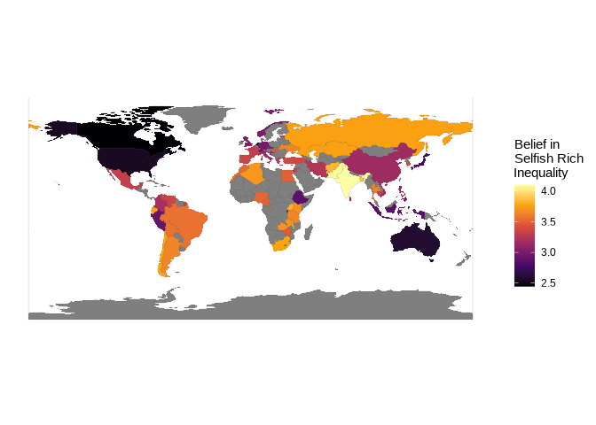
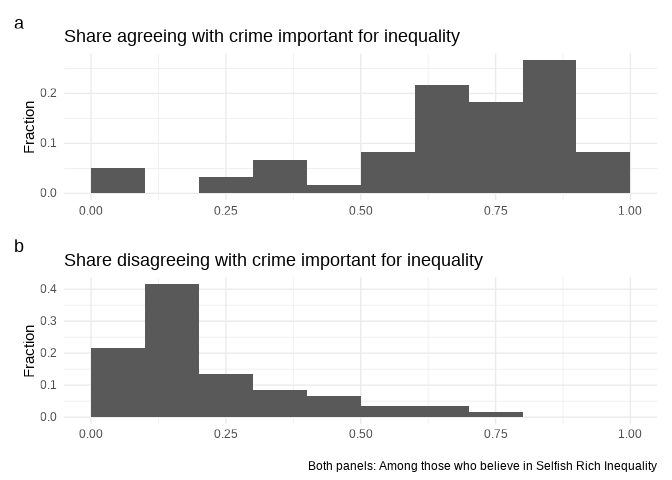
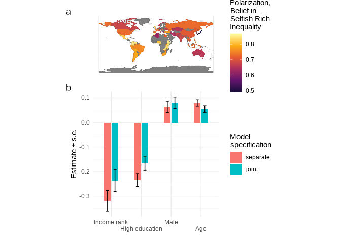

Analysis for global evidence on the selfish rich inequality hypothesis
by Ingvild Almås, Alexander W. Cappelen, Erik Ø. Sørensen and Bertil
Tungodden
================
Erik Ø. Sørensen
17 september, 2021

-   [Summaries of SR support and missing
    variables](#summaries-of-sr-support-and-missing-variables)
-   [Belief in “Selfish Rich Inequality” around the
    world](#belief-in-selfish-rich-inequality-around-the-world)
    -   [A histogram (subfigure)](#a-histogram-subfigure)
    -   [Average beliefs (subfigure)](#average-beliefs-subfigure)
    -   [A global map (subfigure)](#a-global-map-subfigure)
    -   [Putting panels together (Figure in
        paper)](#putting-panels-together-figure-in-paper)
    -   [Histograms for each country (Figure in Supporting
        Information)](#histograms-for-each-country-figure-in-supporting-information)
-   [Between-country variation in
    beliefs](#between-country-variation-in-beliefs)
    -   [Regression coefficients
        (subfigure)](#regression-coefficients-subfigure)
    -   [Belief in Selfish Rich Inequality vs belief in the role of
        crime
        (subfigure)](#belief-in-selfish-rich-inequality-vs-belief-in-the-role-of-crime-subfigure)
    -   [Classifying beliefs by type
        (subfigure)](#classifying-beliefs-by-type-subfigure)
    -   [Belief in crime and mobility
        (subfigure)](#belief-in-crime-and-mobility-subfigure)
    -   [Putting the graphs together (Figure in
        paper)](#putting-the-graphs-together-figure-in-paper)
    -   [Robustness of cross country analysis wrt WDI governance
        indicators (Table in Supporting
        Information)](#robustness-of-cross-country-analysis-wrt-wdi-governance-indicators-table-in-supporting-information)
    -   [Robustness of cross country analysis (Table in Supporting
        Information)](#robustness-of-cross-country-analysis-table-in-supporting-information)
    -   [Exploring corruption and measures of crime (Table in Supporting
        Information)](#exploring-corruption-and-measures-of-crime-table-in-supporting-information)
    -   [Exploring mobility vs corruption (Table in Supporting
        Information)](#exploring-mobility-vs-corruption-table-in-supporting-information)
-   [Within-country variation in
    beliefs](#within-country-variation-in-beliefs)
    -   [Polarization (subfigure)](#polarization-subfigure)
    -   [Figure with regression table results
        (subfigure)](#figure-with-regression-table-results-subfigure)
    -   [Combining within regression plot with polarization map (Figure
        in
        paper)](#combining-within-regression-plot-with-polarization-map-figure-in-paper)
    -   [Polarization for each country (Figure in Supporting
        Information)](#polarization-for-each-country-figure-in-supporting-information)
    -   [Regressions country-specific coefficients (Figure in Supporting
        Information)](#regressions-country-specific-coefficients-figure-in-supporting-information)
-   [Attitudes vs beliefs](#attitudes-vs-beliefs)
    -   [Between analysis (subtable)](#between-analysis-subtable)
    -   [Within analysis (subtable)](#within-analysis-subtable)
-   [The role of religion (Table for Supporting
    Information)](#the-role-of-religion-table-for-supporting-information)
-   [Are the richer more selfish? (Figure for Supporting
    Information)](#are-the-richer-more-selfish-figure-for-supporting-information)
-   [Relation to Durante et al (2017).](#relation-to-durante-et-al-2017)
-   [Session Info](#session-info)

Loading World Poll data:

``` r
WPs <- readRDS(here::here("data","WP_selfishness_confidential.rds"))
```

# Summaries of SR support and missing variables

Average and standard deviation of support in the selfish rich:

``` r
WPs %>% summarize( mean_SR = weighted.mean(more_selfish, wgtw, na.rm=TRUE),
                   sd_SR = weighted.sd(more_selfish, wgtw, na.rm=TRUE))
```

    ## # A tibble: 1 × 2
    ##   mean_SR sd_SR
    ##     <dbl> <dbl>
    ## 1    3.34  1.52

How many did not know or refused to answer?

``` r
WPsmissing <- WPs %>% filter(!is.na(WP20081)) %>%
  mutate(missing_sr = as.numeric(is.na(more_selfish)),
         missing_unfair = as.numeric(is.na(inequality_unfair)),
         missing_govaim = as.numeric(is.na(gov_should_reduce_inequality)),
         anyrefused_sr = (WP20081==99 | WP20082 == 99 | WP20083==99),
         anyrefused_unfair = (WP20096==99 | WP20097==99 | WP20098==99),
         anyrefused_govaim = (WP20099==99 | WP20100==99 | WP20101==99),
         any_missing = pmax(missing_sr, missing_unfair, missing_govaim),
         anyrefused = (anyrefused_sr | anyrefused_unfair | anyrefused_govaim))
table(WPsmissing$WP20081) # Belief in selfish rich
```

    ## 
    ##     1     2     3    98    99 
    ## 12859  8477  3391  1361    84

``` r
table(WPsmissing$WP20096) # Inequality is unfair
```

    ## 
    ##     1     2     3    98    99 
    ## 17343  4766  2799  1175    89

``` r
table(WPsmissing$WP20099) # Government should reduce inequality
```

    ## 
    ##     1     2     3    98    99 
    ## 19644  3179  2094  1160    95

``` r
table(WPsmissing$any_missing)
```

    ## 
    ##     0     1 
    ## 23504  2668

Estimating the shares:

``` r
isos <- unique(WPsmissing$iso_a3)
missing_estimates <- tibble(iso_a3 = isos,
                    missing_sr = rep.int(-99.9, length(isos)),
                    missing_sr_se = rep.int(-99.9, length(isos)),
                    missing_unfair = rep.int(-99.9, length(isos)),
                    missing_unfair_se = rep.int(-99.9, length(isos)),
                    missing_govaim = rep.int(-99.9, length(isos)),
                    missing_govaim_se = rep.int(-99.9, length(isos)))
for (i in seq_along(isos)) {
  cnt <- WPsmissing %>% filter(iso_a3 == isos[i])
  svy_instance <- svydesign(~psuid, weights=~wgt, data=cnt)
  x1 <- svymean(~missing_sr, svy_instance, na.rm=TRUE)
  x2 <- svymean(~missing_unfair, svy_instance, na.rm=TRUE)
  x3 <- svymean(~missing_govaim, svy_instance, na.rm=TRUE)
  missing_estimates[i, "missing_sr"] = mean(x1)
  missing_estimates[i, "missing_sr_se"] = SE(x1)
  missing_estimates[i, "missing_unfair"] = mean(x2)
  missing_estimates[i, "missing_unfair_se"] = SE(x2)
  missing_estimates[i, "missing_govaim"] = mean(x3)
  missing_estimates[i, "missing_govaim_se"] = SE(x3)
}
missing_estimates <- missing_estimates %>% 
  mutate(country = countrycode(iso_a3, "iso3c", "country.name"))
```

``` r
table(WPsmissing$missing_govaim, WPsmissing$missing_unfair)
```

    ##    
    ##         0     1
    ##   0 24276   632
    ##   1   614   650

# Belief in “Selfish Rich Inequality” around the world

## A histogram (subfigure)

Making a histogram:

``` r
gl_bars <- WPs %>% summarize(weighted.bars(more_selfish, wgtw))
gl_bars 
```

    ## # A tibble: 5 × 2
    ##       v proportion
    ##   <dbl>      <dbl>
    ## 1     1      0.180
    ## 2     2      0.165
    ## 3     3      0.135
    ## 4     4      0.175
    ## 5     5      0.345

``` r
gl_bars %>% filter(v>3) %>% summarize(sum_agree = sum(proportion))
```

    ## # A tibble: 1 × 1
    ##   sum_agree
    ##       <dbl>
    ## 1     0.520

``` r
gl_bars %>% filter(v<3) %>% summarize(sum_disagree = sum(proportion))
```

    ## # A tibble: 1 × 1
    ##   sum_disagree
    ##          <dbl>
    ## 1        0.345

``` r
gl_hist <- gl_bars %>% ggplot(aes(x=v, y=proportion)) + 
  geom_bar(stat='identity') +
  theme_minimal() +
  labs(y="Proportion", x="Belief in Selfish Rich Inequality")
gl_hist
```

<!-- -->

## Average beliefs (subfigure)

First to creating the summaries that are to be graphed. I want to take
into account the survey structure as far as I can. I take into account
the sampling weights and the primary sampling unit clustering.

``` r
isos <- unique(WPs$iso_a3)
estimates <- tibble(iso_a3 = isos,
                    selfish_mean = rep.int(-99.9, length(isos)),
                    selfish_se = rep.int(-99.9, length(isos)))
for (i in seq_along(isos)) {
  cnt <- WPs %>% filter(iso_a3 == isos[i])
  svy_instance <- svydesign(~psuid, weights=~wgt, data=cnt)
  x <- svymean(~more_selfish, svy_instance, na.rm=TRUE)
  estimates[i, "selfish_mean"] = mean(x)
  estimates[i, "selfish_se"] = SE(x)
}
estimates <- estimates %>% mutate(country = countrycode(iso_a3, "iso3c", "country.name"))
```

Now, trying to plot these on scale by level. I add the “neutral”
position (3) as a straight line for reference, and add errorbars with
the survey-corrected standard error of means.

``` r
averages_with_se <- estimates %>%
  fatwo_rcfigure(selfish_mean, selfish_se, country,
                 hline=3, path = here::here("graphs","SR_averages_with_se.pdf"))
averages_with_se
```

<!-- -->

## A global map (subfigure)

``` r
bmap_joined <- left_join(World, estimates, by = "iso_a3")

E8 <- ggplot(data=bmap_joined) + 
  geom_sf(aes(fill=selfish_mean), size=0.05) + 
  theme_minimal() + 
  scale_fill_viridis_c(option = "inferno") +
  labs(fill="Belief in\nSelfish Rich\nInequality")

dist_breaks15 <- c(1,2,3,4,5)
E8
```

<!-- -->

## Putting panels together (Figure in paper)

``` r
overview_layout <- "
ABB
ABB
CCC
"
overview_display <- gl_hist + E8 + averages_with_se + plot_annotation(tag_levels = 'a') + plot_layout(design=overview_layout)
overview_display
```

<!-- -->

``` r
ggsave(here::here("graphs","Figure-1.pdf"), width=17.8, height=14.0, units="cm")
```

## Histograms for each country (Figure in Supporting Information)

For the appendix, we want two 30-country graphs for reference. Made for
sideways display, and to cover the whole page. I plot the countries in
alphabetical order.

``` r
country_bars <- WPs %>% group_by(iso_a3) %>% 
  summarize(weighted.bars(more_selfish, wgt)) %>%
  mutate(country = countrycode(iso_a3, "iso3c", "country.name"))
```

    ## `summarise()` has grouped output by 'iso_a3'. You can override using the `.groups` argument.

``` r
countries <- sort( unique(country_bars$country))
countries1 <- countries[1:30]
countries2 <- countries[31:60]
histograms1 <- country_bars %>% filter(country %in% countries1) %>%
  ggplot(aes(x=v, y=proportion)) + 
  geom_bar(stat='identity') + 
  theme_minimal() +
  labs(y="Proportion", x="Belief in Selfish Rich Inequality") +
  facet_wrap(.~country)
histograms1
```

<!-- -->

``` r
ggsave(here::here("graphs","selfishness_histograms1.pdf"), width=24, height = 16, units="cm")
histograms2 <- country_bars %>% filter(country %in% countries2) %>%
  ggplot(aes(x=v, y=proportion)) + 
  geom_bar(stat='identity') + 
  theme_minimal() +
  labs(y="Proportion", x="Belief in Selfish Rich Inequality") +
  facet_wrap(.~country)
histograms2
```

<!-- -->

``` r
ggsave(here::here("graphs","selfishness_histograms2.pdf"), width=24, height = 16, units="cm")
```

How many countries have “agree strongly or disagree strongly” as mode?
First, weighted estimates of the proportions at each level of belief:

``` r
country_bars %>%
  group_by(iso_a3) %>%
  filter(rank(proportion, ties.method="first")==5) %>%
  with(table(v))
```

    ## v
    ##  1  2  3  4  5 
    ##  7  5  3  6 39

In which which countries is there strongest belief in selfish rich
inequality?

``` r
country_bars %>% filter(v==5) %>%
  arrange(-proportion) %>% head()
```

    ## # A tibble: 6 × 4
    ## # Groups:   iso_a3 [6]
    ##   iso_a3     v proportion country 
    ##   <chr>  <dbl>      <dbl> <chr>   
    ## 1 IND        5      0.630 India   
    ## 2 PAK        5      0.594 Pakistan
    ## 3 KEN        5      0.560 Kenya   
    ## 4 MWI        5      0.550 Malawi  
    ## 5 ZMB        5      0.548 Zambia  
    ## 6 UGA        5      0.548 Uganda

And where is there a strong majority disagreeing? I add up the strong
and weak disagreement.

``` r
country_bars %>%
  mutate(more_selfish3 = case_when(
    v <3 ~ "disagree",
    v ==3 ~ "neutral",
    v >3 ~ "agree"
  )) %>% group_by(iso_a3, more_selfish3) %>%
  summarize( proportion = sum(proportion)) %>%
  filter(more_selfish3=="disagree") %>%
  arrange(-proportion) %>% 
  head()
```

    ## `summarise()` has grouped output by 'iso_a3'. You can override using the `.groups` argument.

    ## # A tibble: 6 × 3
    ## # Groups:   iso_a3 [6]
    ##   iso_a3 more_selfish3 proportion
    ##   <chr>  <chr>              <dbl>
    ## 1 CAN    disagree           0.626
    ## 2 USA    disagree           0.590
    ## 3 AUS    disagree           0.563
    ## 4 ETH    disagree           0.556
    ## 5 NLD    disagree           0.553
    ## 6 RWA    disagree           0.496

And where is the mode neutral?

``` r
country_bars %>%
  group_by(iso_a3) %>%
  filter(rank(proportion, ties.method="first")==5) %>%
  filter(v==3) %>% mutate(country = countrycode(iso_a3, "iso3c", "country.name")) 
```

    ## # A tibble: 3 × 4
    ## # Groups:   iso_a3 [3]
    ##   iso_a3     v proportion country
    ##   <chr>  <dbl>      <dbl> <chr>  
    ## 1 CZE        3      0.423 Czechia
    ## 2 HRV        3      0.261 Croatia
    ## 3 JPN        3      0.498 Japan

# Between-country variation in beliefs

``` r
country_bars %>% filter(v==3)
```

    ## # A tibble: 60 × 4
    ## # Groups:   iso_a3 [60]
    ##    iso_a3     v proportion country    
    ##    <chr>  <dbl>      <dbl> <chr>      
    ##  1 AFG        3     0.0441 Afghanistan
    ##  2 ARG        3     0.0935 Argentina  
    ##  3 AUS        3     0.138  Australia  
    ##  4 BGD        3     0.166  Bangladesh 
    ##  5 BOL        3     0.0517 Bolivia    
    ##  6 BRA        3     0.101  Brazil     
    ##  7 CAN        3     0.116  Canada     
    ##  8 CHE        3     0.214  Switzerland
    ##  9 CHL        3     0.112  Chile      
    ## 10 CHN        3     0.198  China      
    ## # … with 50 more rows

Country-level external data that I read in:

``` r
df_selfishness_c <- haven::read_dta(here::here("data", "BSRI_external_data.dta")) %>%
  mutate(zCorruption = as.vector(scale(corruption)),
         zLn_GNI = as.vector(scale(log(GNI))),
         zInequality = as.vector(scale(WYD)),
         zSchooling = as.vector(scale(Schooling)),
         zHDI = as.vector(scale(HDI)),
         zshadow_ec = as.vector(scale(shadow_ec)),
         zorg_crime =  - as.vector(scale(org_crime)), # Flipping sign such that higher number is worse
         zgovernment =  as.vector(scale(government_ineff)),
         zstability =  as.vector(scale(instability)),
         zregulation =  as.vector(scale(poor_reg)),
         zlaw =  as.vector(scale(law)),
         zvoice = as.vector(scale(voice_acc)),
         zgpi = - as.vector(scale(gpi_gpi)),
         country = countrycode(iso_a3, "iso3c","country.name"))
```

I want to extend this data with World Poll variables.

``` r
df_selfishness_c <- WPs %>% group_by(iso_a3) %>%
  summarize( mean_Bs = weighted.mean(more_selfish, wgt, na.rm=TRUE),
             mean_crime = weighted.mean(more_criminal, wgt, na.rm=TRUE),
             dget_ahead = weighted.mean(get_ahead, wgt, na.rm=TRUE),
             MeanAge = weighted.mean(age, wgt, na.rm=TRUE),
             dcorruption_business = weighted.mean(corruption_business, wgt, na.rm=TRUE),
             dcorruption_government = weighted.mean(corruption_government, wgt, na.rm=TRUE)
             ) %>%
  ungroup() %>%
  mutate( zget_ahead = as.vector(scale(dget_ahead)),
          zMeanAge = as.vector(scale(MeanAge)),
          zcorruption_business = as.vector(scale(dcorruption_business)),
          zcorruption_government = as.vector(scale(dcorruption_government))
         ) %>%
  left_join(df_selfishness_c)
```

    ## Joining, by = "iso_a3"

What are the correlations between the different crime/corruption
variables?

``` r
df_selfishness_c %>% dplyr::select(zCorruption, zshadow_ec, zorg_crime) %>%
  cor(use="pairwise.complete.obs") %>% kable(digits=3)
```

<table>
<thead>
<tr>
<th style="text-align:left;">
</th>
<th style="text-align:right;">
zCorruption
</th>
<th style="text-align:right;">
zshadow\_ec
</th>
<th style="text-align:right;">
zorg\_crime
</th>
</tr>
</thead>
<tbody>
<tr>
<td style="text-align:left;">
zCorruption
</td>
<td style="text-align:right;">
1.000
</td>
<td style="text-align:right;">
0.774
</td>
<td style="text-align:right;">
0.662
</td>
</tr>
<tr>
<td style="text-align:left;">
zshadow\_ec
</td>
<td style="text-align:right;">
0.774
</td>
<td style="text-align:right;">
1.000
</td>
<td style="text-align:right;">
0.475
</td>
</tr>
<tr>
<td style="text-align:left;">
zorg\_crime
</td>
<td style="text-align:right;">
0.662
</td>
<td style="text-align:right;">
0.475
</td>
<td style="text-align:right;">
1.000
</td>
</tr>
</tbody>
</table>

## Regression coefficients (subfigure)

Having read the data, I create a data frame of regression coefficients.

``` r
l1 <- df_selfishness_c %>% lm(mean_Bs ~ zCorruption, data=.)
l2 <- df_selfishness_c %>% lm(mean_Bs ~ zLn_GNI, data=.)
l3 <- df_selfishness_c %>% lm(mean_Bs ~ zInequality, data=.)
l4 <- df_selfishness_c %>% lm(mean_Bs ~ zMeanAge, data=.)
l5 <- df_selfishness_c %>% lm(mean_Bs ~ zSchooling, data=.)
l6 <- df_selfishness_c %>% lm(mean_Bs ~ zCorruption + zLn_GNI  + zSchooling +
                               zInequality + zMeanAge + zSchooling, data=.)

modelsc <- list(l1=l1,l2=l2,l3=l3,l4=l4,l5=l5,l6=l6)
modelsc_df <- purrr::map_df(modelsc, broom::tidy, .id = "model")
```

Having the data, now to plot them:

``` r
params_to_plot <- modelsc_df %>% filter(term != "(Intercept)") %>%
  mutate(new_name = case_when(
    term == "zCorruption" ~ "Corruption",
    term == "zcorruption_government" ~ "Corruption G",
    term == "zcorruption_business" ~ "Corruption B",
    term == "zcorruption_WP" ~ "Corruption (WP)",
    term == "zLn_GNI" ~ "GNI",
    term == "zInequality" ~ "Inequality",
    term == "zget_ahead" ~ "Mobility",
    term == "zMeanAge" ~ "Age",
    term == "zSchooling" ~ "Education" )) %>%
  mutate(model_spec = factor( ifelse(model=="l6", "joint", "separate"),
                              levels = c("separate", "joint")),
         termf = factor(new_name, levels=c("Corruption", "Corruption G", "Corruption B", "Corruption (WP)", "GNI","Inequality","Mobility",
                                       "Age", "Education")))
country_param_plot <- params_to_plot %>% 
  ggplot(aes(y=estimate, 
             x=termf, 
             fill=model_spec, 
             group=model_spec,
             ymin = estimate - std.error,
             ymax = estimate + std.error)) +
  geom_bar(stat='identity', width=0.5, orientation = "x",
           position = position_dodge2(width = 0.5)) +
  geom_errorbar(width=0.2, position = position_dodge(width = 0.5 )) +
  theme_minimal() +
  labs(x = element_blank(),
       y = "Estimate \u00B1 s.e.",
       fill = "Model\nspecification") +
  scale_x_discrete(guide = guide_axis(n.dodge = 2))
country_param_plot
```

<!-- -->

Statistical test provided in paper:

``` r
car::linearHypothesis(l1, c("zCorruption = 0"))
```

    ## Linear hypothesis test
    ## 
    ## Hypothesis:
    ## zCorruption = 0
    ## 
    ## Model 1: restricted model
    ## Model 2: mean_Bs ~ zCorruption
    ## 
    ##   Res.Df    RSS Df Sum of Sq      F    Pr(>F)    
    ## 1     59 8.6570                                  
    ## 2     58 5.3077  1    3.3492 36.599 1.128e-07 ***
    ## ---
    ## Signif. codes:  0 '***' 0.001 '**' 0.01 '*' 0.05 '.' 0.1 ' ' 1

And now for the joint specification:

``` r
car::linearHypothesis(l6, "zCorruption = 0")
```

    ## Linear hypothesis test
    ## 
    ## Hypothesis:
    ## zCorruption = 0
    ## 
    ## Model 1: restricted model
    ## Model 2: mean_Bs ~ zCorruption + zLn_GNI + zSchooling + zInequality + 
    ##     zMeanAge + zSchooling
    ## 
    ##   Res.Df    RSS Df Sum of Sq      F Pr(>F)  
    ## 1     52 5.1798                             
    ## 2     51 4.6842  1   0.49565 5.3965 0.0242 *
    ## ---
    ## Signif. codes:  0 '***' 0.001 '**' 0.01 '*' 0.05 '.' 0.1 ' ' 1

The regressions, for reference:

``` r
aggregate_names <- c("zCorruption"="Corruption", 
                     "zLn_GNI"="GNI", 
                     "zInequality"="Inequality", 
                     "zget_ahead"="Mobility", 
                     "zMeanAge"="Age", 
                     "zSchooling"="Education" )
msummary(list(l1,l2,l3,l4,l5,l6),
         title="Country level associations", coef_map=aggregate_names,
         stars = c("*"=0.1, "**"=0.05, "***"=0.01),
         gof_omit ="R2.Adj|AIC|BIC|Log.Lik.|F") %>%
  add_header_above(c(" "=1, "Separate"=5, "Joint"=1))
```

<table style="NAborder-bottom: 0; width: auto !important; margin-left: auto; margin-right: auto;" class="table">
<caption>
Country level associations
</caption>
<thead>
<tr>
<th style="empty-cells: hide;border-bottom:hidden;" colspan="1">
</th>
<th style="border-bottom:hidden;padding-bottom:0; padding-left:3px;padding-right:3px;text-align: center; " colspan="5">

<div style="border-bottom: 1px solid #ddd; padding-bottom: 5px; ">

Separate

</div>

</th>
<th style="border-bottom:hidden;padding-bottom:0; padding-left:3px;padding-right:3px;text-align: center; " colspan="1">

<div style="border-bottom: 1px solid #ddd; padding-bottom: 5px; ">

Joint

</div>

</th>
</tr>
<tr>
<th style="text-align:left;">
</th>
<th style="text-align:center;">
Model 1
</th>
<th style="text-align:center;">
Model 2
</th>
<th style="text-align:center;">
Model 3
</th>
<th style="text-align:center;">
Model 4
</th>
<th style="text-align:center;">
Model 5
</th>
<th style="text-align:center;">
Model 6
</th>
</tr>
</thead>
<tbody>
<tr>
<td style="text-align:left;">
Corruption
</td>
<td style="text-align:center;">
0.238\*\*\*
</td>
<td style="text-align:center;">
</td>
<td style="text-align:center;">
</td>
<td style="text-align:center;">
</td>
<td style="text-align:center;">
</td>
<td style="text-align:center;">
0.158\*\*
</td>
</tr>
<tr>
<td style="text-align:left;">
</td>
<td style="text-align:center;">
(0.039)
</td>
<td style="text-align:center;">
</td>
<td style="text-align:center;">
</td>
<td style="text-align:center;">
</td>
<td style="text-align:center;">
</td>
<td style="text-align:center;">
(0.068)
</td>
</tr>
<tr>
<td style="text-align:left;">
GNI
</td>
<td style="text-align:center;">
</td>
<td style="text-align:center;">
−0.205\*\*\*
</td>
<td style="text-align:center;">
</td>
<td style="text-align:center;">
</td>
<td style="text-align:center;">
</td>
<td style="text-align:center;">
−0.035
</td>
</tr>
<tr>
<td style="text-align:left;">
</td>
<td style="text-align:center;">
</td>
<td style="text-align:center;">
(0.042)
</td>
<td style="text-align:center;">
</td>
<td style="text-align:center;">
</td>
<td style="text-align:center;">
</td>
<td style="text-align:center;">
(0.114)
</td>
</tr>
<tr>
<td style="text-align:left;">
Inequality
</td>
<td style="text-align:center;">
</td>
<td style="text-align:center;">
</td>
<td style="text-align:center;">
0.075
</td>
<td style="text-align:center;">
</td>
<td style="text-align:center;">
</td>
<td style="text-align:center;">
−0.003
</td>
</tr>
<tr>
<td style="text-align:left;">
</td>
<td style="text-align:center;">
</td>
<td style="text-align:center;">
</td>
<td style="text-align:center;">
(0.049)
</td>
<td style="text-align:center;">
</td>
<td style="text-align:center;">
</td>
<td style="text-align:center;">
(0.044)
</td>
</tr>
<tr>
<td style="text-align:left;">
Age
</td>
<td style="text-align:center;">
</td>
<td style="text-align:center;">
</td>
<td style="text-align:center;">
</td>
<td style="text-align:center;">
−0.209\*\*\*
</td>
<td style="text-align:center;">
</td>
<td style="text-align:center;">
−0.060
</td>
</tr>
<tr>
<td style="text-align:left;">
</td>
<td style="text-align:center;">
</td>
<td style="text-align:center;">
</td>
<td style="text-align:center;">
</td>
<td style="text-align:center;">
(0.042)
</td>
<td style="text-align:center;">
</td>
<td style="text-align:center;">
(0.097)
</td>
</tr>
<tr>
<td style="text-align:left;">
Education
</td>
<td style="text-align:center;">
</td>
<td style="text-align:center;">
</td>
<td style="text-align:center;">
</td>
<td style="text-align:center;">
</td>
<td style="text-align:center;">
−0.211\*\*\*
</td>
<td style="text-align:center;">
−0.022
</td>
</tr>
<tr>
<td style="text-align:left;box-shadow: 0px 1px">
</td>
<td style="text-align:center;box-shadow: 0px 1px">
</td>
<td style="text-align:center;box-shadow: 0px 1px">
</td>
<td style="text-align:center;box-shadow: 0px 1px">
</td>
<td style="text-align:center;box-shadow: 0px 1px">
</td>
<td style="text-align:center;box-shadow: 0px 1px">
(0.043)
</td>
<td style="text-align:center;box-shadow: 0px 1px">
(0.081)
</td>
</tr>
<tr>
<td style="text-align:left;">
Num.Obs.
</td>
<td style="text-align:center;">
60
</td>
<td style="text-align:center;">
60
</td>
<td style="text-align:center;">
59
</td>
<td style="text-align:center;">
60
</td>
<td style="text-align:center;">
58
</td>
<td style="text-align:center;">
57
</td>
</tr>
<tr>
<td style="text-align:left;">
R2
</td>
<td style="text-align:center;">
0.387
</td>
<td style="text-align:center;">
0.287
</td>
<td style="text-align:center;">
0.039
</td>
<td style="text-align:center;">
0.298
</td>
<td style="text-align:center;">
0.301
</td>
<td style="text-align:center;">
0.426
</td>
</tr>
</tbody>
<tfoot>
<tr>
<td style="padding: 0; " colspan="100%">
<sup></sup> \* p &lt; 0.1, \*\* p &lt; 0.05, \*\*\* p &lt; 0.01
</td>
</tr>
</tfoot>
</table>

``` r
msummary(list(l1,l2,l3,l4,l5,l6),
         title="Country level associations", coef_map=aggregate_names,
         stars = c("*"=0.1, "**"=0.05, "***"=0.01),
         output = "latex",
         gof_omit ="R2.Adj|AIC|BIC|Log.Lik.|F") %>%
  add_header_above(c(" "=1, "Separate"=5, "Joint"=1)) %>%
  cat(file=here::here("tables","selfishness_between_bg.tex"))
```

    ## Warning: To compile a LaTeX document with this table, the following commands must be placed in the document preamble:
    ## 
    ## \usepackage{booktabs}
    ## \usepackage{siunitx}
    ## \newcolumntype{d}{S[input-symbols = ()]}
    ## 
    ## To disable `siunitx` and prevent `modelsummary` from wrapping numeric entries in `\num{}`, call:
    ## 
    ## options("modelsummary_format_numeric_latex" = "plain")
    ## 
    ## This warning is displayed once per session.

``` r
summary(l6)
```

    ## 
    ## Call:
    ## lm(formula = mean_Bs ~ zCorruption + zLn_GNI + zSchooling + zInequality + 
    ##     zMeanAge + zSchooling, data = .)
    ## 
    ## Residuals:
    ##     Min      1Q  Median      3Q     Max 
    ## -0.5893 -0.2119  0.0489  0.2143  0.6378 
    ## 
    ## Coefficients:
    ##              Estimate Std. Error t value Pr(>|t|)    
    ## (Intercept)  3.355807   0.040393  83.078   <2e-16 ***
    ## zCorruption  0.157649   0.067863   2.323   0.0242 *  
    ## zLn_GNI     -0.034785   0.114325  -0.304   0.7622    
    ## zSchooling  -0.022382   0.081323  -0.275   0.7843    
    ## zInequality -0.002672   0.044326  -0.060   0.9522    
    ## zMeanAge    -0.059582   0.096642  -0.617   0.5403    
    ## ---
    ## Signif. codes:  0 '***' 0.001 '**' 0.01 '*' 0.05 '.' 0.1 ' ' 1
    ## 
    ## Residual standard error: 0.3031 on 51 degrees of freedom
    ##   (3 observations deleted due to missingness)
    ## Multiple R-squared:  0.4263, Adjusted R-squared:   0.37 
    ## F-statistic: 7.579 on 5 and 51 DF,  p-value: 2.195e-05

## Belief in Selfish Rich Inequality vs belief in the role of crime (subfigure)

``` r
df_crime_selfish_c <- WPs %>% 
  group_by(iso_a3) %>%
  summarize(more_selfish = weighted.mean(more_selfish, wgt, na.rm = TRUE),
            more_criminal = weighted.mean(more_criminal, wgt, na.rm = TRUE))
selfish_crime <- df_crime_selfish_c %>%
  ggplot(aes(y=more_selfish, x=more_criminal)) +
  geom_point() +
  geom_smooth(method = 'lm', color='black') +
  theme_minimal() +
  labs(x = "Belief in the role of crime",
       y = "Belief in SRI")
selfish_crime
```

    ## `geom_smooth()` using formula 'y ~ x'

    ## Warning: Removed 2 rows containing non-finite values (stat_smooth).

    ## Warning: Removed 2 rows containing missing values (geom_point).

<!-- -->

The belief/crime regression for reference and the reported test:

``` r
reg_selfish_crime <- lm(more_selfish ~ more_criminal, data=df_crime_selfish_c ) 
reg_selfish_crime %>% summary
```

    ## 
    ## Call:
    ## lm(formula = more_selfish ~ more_criminal, data = df_crime_selfish_c)
    ## 
    ## Residuals:
    ##      Min       1Q   Median       3Q      Max 
    ## -0.47712 -0.16641  0.00222  0.13414  0.42741 
    ## 
    ## Coefficients:
    ##               Estimate Std. Error t value Pr(>|t|)    
    ## (Intercept)    1.52397    0.16995   8.967 2.04e-12 ***
    ## more_criminal  0.54762    0.05032  10.883 1.95e-15 ***
    ## ---
    ## Signif. codes:  0 '***' 0.001 '**' 0.01 '*' 0.05 '.' 0.1 ' ' 1
    ## 
    ## Residual standard error: 0.2223 on 56 degrees of freedom
    ##   (2 observations deleted due to missingness)
    ## Multiple R-squared:  0.679,  Adjusted R-squared:  0.6732 
    ## F-statistic: 118.4 on 1 and 56 DF,  p-value: 1.947e-15

``` r
car::linearHypothesis(reg_selfish_crime, "more_criminal")
```

    ## Linear hypothesis test
    ## 
    ## Hypothesis:
    ## more_criminal = 0
    ## 
    ## Model 1: restricted model
    ## Model 2: more_selfish ~ more_criminal
    ## 
    ##   Res.Df    RSS Df Sum of Sq      F    Pr(>F)    
    ## 1     57 8.6224                                  
    ## 2     56 2.7679  1    5.8545 118.45 1.947e-15 ***
    ## ---
    ## Signif. codes:  0 '***' 0.001 '**' 0.01 '*' 0.05 '.' 0.1 ' ' 1

And what were the responses to Crime? First the total number asked, then
the number of missing:

``` r
(asked_crime <- sum(table(WPs$WP20093)))
```

    ## [1] 24535

``` r
(missing_crime <- asked_crime - sum(table(WPs$more_criminal)))
```

    ## [1] 1820

## Classifying beliefs by type (subfigure)

``` r
belief_classification <- WPs %>% mutate( agree_crime_amongBSR = ifelse(more_selfish %in% c(4,5) & 
                                                                         !is.na(more_criminal), 
                                              more_criminal %in% c(4,5),
                                              NA),
                                         disagree_crime_amongBSR = ifelse(more_selfish %in% c(4,5) & 
                                                                         !is.na(more_criminal), 
                                              more_criminal %in% c(1,2),
                                              NA),
                                         agree_crime_and_BSR = ifelse(!is.na(more_selfish) &
                                                                        !is.na(more_criminal),
                                                                       (more_selfish %in% c(4,5)) & 
                                                                        (more_criminal %in% c(4,5)),
                                                                      NA),
                                         disagree_crime_and_BSR = ifelse(!is.na(more_selfish) &
                                                                        !is.na(more_criminal),
                                                                       (more_selfish %in% c(4,5)) & 
                                                                        (more_criminal %in% c(1,2)),
                                                                      NA),
                                         agree_BSR = ifelse(!is.na(more_selfish), more_selfish %in% c(4,5), NA),
                                         agree_crime = ifelse(!is.na(more_criminal) , more_criminal %in% c(4,5), NA)) %>%
  srvyr::as_survey_design(psuid, weights=wgtw) %>%
  group_by(iso_a3) %>%
  summarize( agree_crime_amongBSR = srvyr::survey_mean(agree_crime_amongBSR,na.rm=TRUE),
             disagree_crime_amongBSR = srvyr::survey_mean(disagree_crime_amongBSR, na.rm=TRUE),
             agree_crime_and_BSR = srvyr::survey_mean(agree_crime_and_BSR, na.rm=TRUE),
             disagree_crime_and_BSR = srvyr::survey_mean(disagree_crime_and_BSR, na.rm=TRUE),
             agree_BSR = srvyr::survey_mean(agree_BSR, na.rm=TRUE),
             agree_crime = srvyr::survey_mean(agree_crime, na.rm=TRUE)
             ) %>% 
  mutate(country=countrycode(iso_a3, "iso3c","country.name"))
belief_classification %>% skimr::skim()
```

<table style="width: auto;" class="table table-condensed">
<caption>
Data summary
</caption>
<thead>
<tr>
<th style="text-align:left;">
</th>
<th style="text-align:left;">
</th>
</tr>
</thead>
<tbody>
<tr>
<td style="text-align:left;">
Name
</td>
<td style="text-align:left;">
Piped data
</td>
</tr>
<tr>
<td style="text-align:left;">
Number of rows
</td>
<td style="text-align:left;">
60
</td>
</tr>
<tr>
<td style="text-align:left;">
Number of columns
</td>
<td style="text-align:left;">
14
</td>
</tr>
<tr>
<td style="text-align:left;">
\_\_\_\_\_\_\_\_\_\_\_\_\_\_\_\_\_\_\_\_\_\_\_
</td>
<td style="text-align:left;">
</td>
</tr>
<tr>
<td style="text-align:left;">
Column type frequency:
</td>
<td style="text-align:left;">
</td>
</tr>
<tr>
<td style="text-align:left;">
character
</td>
<td style="text-align:left;">
2
</td>
</tr>
<tr>
<td style="text-align:left;">
numeric
</td>
<td style="text-align:left;">
12
</td>
</tr>
<tr>
<td style="text-align:left;">
\_\_\_\_\_\_\_\_\_\_\_\_\_\_\_\_\_\_\_\_\_\_\_\_
</td>
<td style="text-align:left;">
</td>
</tr>
<tr>
<td style="text-align:left;">
Group variables
</td>
<td style="text-align:left;">
None
</td>
</tr>
</tbody>
</table>

**Variable type: character**

<table>
<thead>
<tr>
<th style="text-align:left;">
skim\_variable
</th>
<th style="text-align:right;">
n\_missing
</th>
<th style="text-align:right;">
complete\_rate
</th>
<th style="text-align:right;">
min
</th>
<th style="text-align:right;">
max
</th>
<th style="text-align:right;">
empty
</th>
<th style="text-align:right;">
n\_unique
</th>
<th style="text-align:right;">
whitespace
</th>
</tr>
</thead>
<tbody>
<tr>
<td style="text-align:left;">
iso\_a3
</td>
<td style="text-align:right;">
0
</td>
<td style="text-align:right;">
1
</td>
<td style="text-align:right;">
3
</td>
<td style="text-align:right;">
3
</td>
<td style="text-align:right;">
0
</td>
<td style="text-align:right;">
60
</td>
<td style="text-align:right;">
0
</td>
</tr>
<tr>
<td style="text-align:left;">
country
</td>
<td style="text-align:right;">
0
</td>
<td style="text-align:right;">
1
</td>
<td style="text-align:right;">
4
</td>
<td style="text-align:right;">
14
</td>
<td style="text-align:right;">
0
</td>
<td style="text-align:right;">
60
</td>
<td style="text-align:right;">
0
</td>
</tr>
</tbody>
</table>

**Variable type: numeric**

<table>
<thead>
<tr>
<th style="text-align:left;">
skim\_variable
</th>
<th style="text-align:right;">
n\_missing
</th>
<th style="text-align:right;">
complete\_rate
</th>
<th style="text-align:right;">
mean
</th>
<th style="text-align:right;">
sd
</th>
<th style="text-align:right;">
p0
</th>
<th style="text-align:right;">
p25
</th>
<th style="text-align:right;">
p50
</th>
<th style="text-align:right;">
p75
</th>
<th style="text-align:right;">
p100
</th>
<th style="text-align:left;">
hist
</th>
</tr>
</thead>
<tbody>
<tr>
<td style="text-align:left;">
agree\_crime\_amongBSR
</td>
<td style="text-align:right;">
0
</td>
<td style="text-align:right;">
1
</td>
<td style="text-align:right;">
0.67
</td>
<td style="text-align:right;">
0.23
</td>
<td style="text-align:right;">
0.00
</td>
<td style="text-align:right;">
0.60
</td>
<td style="text-align:right;">
0.73
</td>
<td style="text-align:right;">
0.83
</td>
<td style="text-align:right;">
0.94
</td>
<td style="text-align:left;">
▁▂▂▅▇
</td>
</tr>
<tr>
<td style="text-align:left;">
agree\_crime\_amongBSR\_se
</td>
<td style="text-align:right;">
0
</td>
<td style="text-align:right;">
1
</td>
<td style="text-align:right;">
0.07
</td>
<td style="text-align:right;">
0.03
</td>
<td style="text-align:right;">
0.00
</td>
<td style="text-align:right;">
0.06
</td>
<td style="text-align:right;">
0.07
</td>
<td style="text-align:right;">
0.09
</td>
<td style="text-align:right;">
0.12
</td>
<td style="text-align:left;">
▁▂▇▆▂
</td>
</tr>
<tr>
<td style="text-align:left;">
disagree\_crime\_amongBSR
</td>
<td style="text-align:right;">
0
</td>
<td style="text-align:right;">
1
</td>
<td style="text-align:right;">
0.21
</td>
<td style="text-align:right;">
0.17
</td>
<td style="text-align:right;">
0.00
</td>
<td style="text-align:right;">
0.12
</td>
<td style="text-align:right;">
0.17
</td>
<td style="text-align:right;">
0.27
</td>
<td style="text-align:right;">
0.76
</td>
<td style="text-align:left;">
▇▅▂▂▁
</td>
</tr>
<tr>
<td style="text-align:left;">
disagree\_crime\_amongBSR\_se
</td>
<td style="text-align:right;">
0
</td>
<td style="text-align:right;">
1
</td>
<td style="text-align:right;">
0.06
</td>
<td style="text-align:right;">
0.03
</td>
<td style="text-align:right;">
0.00
</td>
<td style="text-align:right;">
0.05
</td>
<td style="text-align:right;">
0.06
</td>
<td style="text-align:right;">
0.08
</td>
<td style="text-align:right;">
0.12
</td>
<td style="text-align:left;">
▂▃▇▃▂
</td>
</tr>
<tr>
<td style="text-align:left;">
agree\_crime\_and\_BSR
</td>
<td style="text-align:right;">
0
</td>
<td style="text-align:right;">
1
</td>
<td style="text-align:right;">
0.37
</td>
<td style="text-align:right;">
0.17
</td>
<td style="text-align:right;">
0.00
</td>
<td style="text-align:right;">
0.25
</td>
<td style="text-align:right;">
0.41
</td>
<td style="text-align:right;">
0.50
</td>
<td style="text-align:right;">
0.68
</td>
<td style="text-align:left;">
▂▃▅▇▃
</td>
</tr>
<tr>
<td style="text-align:left;">
agree\_crime\_and\_BSR\_se
</td>
<td style="text-align:right;">
0
</td>
<td style="text-align:right;">
1
</td>
<td style="text-align:right;">
0.06
</td>
<td style="text-align:right;">
0.02
</td>
<td style="text-align:right;">
0.00
</td>
<td style="text-align:right;">
0.05
</td>
<td style="text-align:right;">
0.06
</td>
<td style="text-align:right;">
0.07
</td>
<td style="text-align:right;">
0.07
</td>
<td style="text-align:left;">
▁▁▁▆▇
</td>
</tr>
<tr>
<td style="text-align:left;">
disagree\_crime\_and\_BSR
</td>
<td style="text-align:right;">
0
</td>
<td style="text-align:right;">
1
</td>
<td style="text-align:right;">
0.10
</td>
<td style="text-align:right;">
0.07
</td>
<td style="text-align:right;">
0.00
</td>
<td style="text-align:right;">
0.06
</td>
<td style="text-align:right;">
0.09
</td>
<td style="text-align:right;">
0.14
</td>
<td style="text-align:right;">
0.33
</td>
<td style="text-align:left;">
▆▇▃▂▁
</td>
</tr>
<tr>
<td style="text-align:left;">
disagree\_crime\_and\_BSR\_se
</td>
<td style="text-align:right;">
0
</td>
<td style="text-align:right;">
1
</td>
<td style="text-align:right;">
0.03
</td>
<td style="text-align:right;">
0.02
</td>
<td style="text-align:right;">
0.00
</td>
<td style="text-align:right;">
0.02
</td>
<td style="text-align:right;">
0.04
</td>
<td style="text-align:right;">
0.04
</td>
<td style="text-align:right;">
0.06
</td>
<td style="text-align:left;">
▂▃▆▇▆
</td>
</tr>
<tr>
<td style="text-align:left;">
agree\_BSR
</td>
<td style="text-align:right;">
0
</td>
<td style="text-align:right;">
1
</td>
<td style="text-align:right;">
0.52
</td>
<td style="text-align:right;">
0.13
</td>
<td style="text-align:right;">
0.18
</td>
<td style="text-align:right;">
0.44
</td>
<td style="text-align:right;">
0.53
</td>
<td style="text-align:right;">
0.61
</td>
<td style="text-align:right;">
0.74
</td>
<td style="text-align:left;">
▁▃▇▇▅
</td>
</tr>
<tr>
<td style="text-align:left;">
agree\_BSR\_se
</td>
<td style="text-align:right;">
0
</td>
<td style="text-align:right;">
1
</td>
<td style="text-align:right;">
0.03
</td>
<td style="text-align:right;">
0.00
</td>
<td style="text-align:right;">
0.02
</td>
<td style="text-align:right;">
0.03
</td>
<td style="text-align:right;">
0.03
</td>
<td style="text-align:right;">
0.03
</td>
<td style="text-align:right;">
0.04
</td>
<td style="text-align:left;">
▁▂▇▅▂
</td>
</tr>
<tr>
<td style="text-align:left;">
agree\_crime
</td>
<td style="text-align:right;">
0
</td>
<td style="text-align:right;">
1
</td>
<td style="text-align:right;">
0.49
</td>
<td style="text-align:right;">
0.20
</td>
<td style="text-align:right;">
0.00
</td>
<td style="text-align:right;">
0.37
</td>
<td style="text-align:right;">
0.55
</td>
<td style="text-align:right;">
0.63
</td>
<td style="text-align:right;">
0.87
</td>
<td style="text-align:left;">
▁▃▃▇▂
</td>
</tr>
<tr>
<td style="text-align:left;">
agree\_crime\_se
</td>
<td style="text-align:right;">
0
</td>
<td style="text-align:right;">
1
</td>
<td style="text-align:right;">
0.03
</td>
<td style="text-align:right;">
0.01
</td>
<td style="text-align:right;">
0.00
</td>
<td style="text-align:right;">
0.03
</td>
<td style="text-align:right;">
0.03
</td>
<td style="text-align:right;">
0.03
</td>
<td style="text-align:right;">
0.04
</td>
<td style="text-align:left;">
▁▁▂▇▂
</td>
</tr>
</tbody>
</table>

``` r
histogram_agree_conditional <- belief_classification %>%
  ggplot(aes(x = agree_crime_amongBSR, y= (..count..)/tapply(..count..,..PANEL..,sum)[..PANEL..])) +
  geom_histogram(binwidth=0.1, boundary=0) +
  theme_minimal() +
  labs(x = "Share agreeing to SRI and Crime",
       y = "Fraction")
histogram_disagree_conditional <- belief_classification %>%
  ggplot(aes(x = disagree_crime_amongBSR,  y= (..count..)/tapply(..count..,..PANEL..,sum)[..PANEL..])) +
  geom_histogram(binwidth=0.1, boundary=0) +
  theme_minimal() +
  labs(x = "Share disagreeing with Crime as cause\n(among those who believe in Selfish Rich Inequality)",
       y = "Fraction")  +
  xlim(c(0,1))

histogram_agree_conditional
```

<!-- -->

``` r
histogram_disagree_conditional
```

<!-- -->

``` r
histupper <- histogram_agree_conditional + labs(x=element_blank(), y = "Fraction", title="Share agreeing with crime important for inequality")
histlower <- histogram_disagree_conditional + labs(x=element_blank(), y = "Fraction", title="Share disagreeing with crime important for inequality")

histupper / histlower  + plot_annotation(tag_levels = 'a', caption="Both panels: Among those who believe in Selfish Rich Inequality")
```

<!-- -->

``` r
ggsave(here::here("graphs","belief_classifications_histogram.pdf"), width = 16, height = 16, units = "cm")
```

Graphs with the shares agreeing and disagreeing with the role of crime
among those who do believe selfish rich inequality.

``` r
crime_agree_amongBSR_graph <- belief_classification %>% 
  filter(!(iso_a3 %in% c("CHN","JOR"))) %>%
  fatwo_rcfigure(agree_crime_amongBSR, se = agree_crime_amongBSR_se, group = country, 
                 title = "Share agreeing with crime important for inequality",
                 ytitle = "Share \u00B1 s.e.", ylim=c(0,1))
crime_disagree_amongBSR_graph <- belief_classification %>% 
  filter(!(iso_a3 %in% c("CHN","JOR"))) %>%
  fatwo_rcfigure(disagree_crime_amongBSR, se = disagree_crime_amongBSR_se, group = country, 
                 title = "Share disagreeing with crime important for inequality",
                 ytitle = "Share \u00B1 s.e.", ylim=c(0,1))
crime_agree_amongBSR_graph / crime_disagree_amongBSR_graph + plot_annotation(tag_levels = "a")
```

<!-- -->

``` r
ggsave(here::here("graphs","belief_classifications_ranked.pdf"), width=16, height = 16, units = "cm")
```

In how many countries is there a majority for belief in crime **among**
those who believe in SRI?

``` r
table(belief_classification$agree_crime_amongBSR > 0.5)
```

    ## 
    ## FALSE  TRUE 
    ##    10    50

In how many countries is there a majority disagreeing with belief in
crime **among** those who believe in SRI?

``` r
table(belief_classification$disagree_crime_amongBSR > 0.5)
```

    ## 
    ## FALSE  TRUE 
    ##    55     5

In how many countries is there a at least 30% disagreeing with belief in
crime **among** those who believe in SRI?

``` r
table(belief_classification$disagree_crime_amongBSR > 0.3)
```

    ## 
    ## FALSE  TRUE 
    ##    46    14

## Belief in crime and mobility (subfigure)

``` r
df_crime_mobility_c <- WPs %>% 
  group_by(iso_a3) %>%
  summarize(get_ahead  = weighted.mean(get_ahead, wgt, na.rm = TRUE),
            more_criminal = weighted.mean(more_criminal, wgt, na.rm = TRUE))
crime_mobility <- df_crime_mobility_c %>%
  ggplot(aes(y=get_ahead, x=more_criminal)) +
  geom_point() +
  geom_smooth(method = 'lm', color='black') +
  theme_minimal() +
  labs(x = "Belief in the role of crime",
       y = "Belief in mobility")
crime_mobility
```

    ## `geom_smooth()` using formula 'y ~ x'

    ## Warning: Removed 2 rows containing non-finite values (stat_smooth).

    ## Warning: Removed 2 rows containing missing values (geom_point).

<!-- -->

And what does the regression line look like?

``` r
reg_crime_mobility <- df_crime_mobility_c %>% lm(get_ahead ~ more_criminal, data=.)
reg_crime_mobility %>% summary
```

    ## 
    ## Call:
    ## lm(formula = get_ahead ~ more_criminal, data = .)
    ## 
    ## Residuals:
    ##      Min       1Q   Median       3Q      Max 
    ## -0.35385 -0.08449  0.06137  0.11156  0.16037 
    ## 
    ## Coefficients:
    ##               Estimate Std. Error t value Pr(>|t|)    
    ## (Intercept)    1.02793    0.10411   9.873 7.24e-14 ***
    ## more_criminal -0.06268    0.03082  -2.033   0.0468 *  
    ## ---
    ## Signif. codes:  0 '***' 0.001 '**' 0.01 '*' 0.05 '.' 0.1 ' ' 1
    ## 
    ## Residual standard error: 0.1362 on 56 degrees of freedom
    ##   (2 observations deleted due to missingness)
    ## Multiple R-squared:  0.06876,    Adjusted R-squared:  0.05213 
    ## F-statistic: 4.135 on 1 and 56 DF,  p-value: 0.04676

``` r
linearHypothesis(reg_crime_mobility, "more_criminal = 0")
```

    ## Linear hypothesis test
    ## 
    ## Hypothesis:
    ## more_criminal = 0
    ## 
    ## Model 1: restricted model
    ## Model 2: get_ahead ~ more_criminal
    ## 
    ##   Res.Df    RSS Df Sum of Sq      F  Pr(>F)  
    ## 1     57 1.1154                              
    ## 2     56 1.0387  1  0.076696 4.1348 0.04676 *
    ## ---
    ## Signif. codes:  0 '***' 0.001 '**' 0.01 '*' 0.05 '.' 0.1 ' ' 1

## Putting the graphs together (Figure in paper)

``` r
country_param_plot + selfish_crime + histogram_agree_conditional + crime_mobility + 
  plot_annotation(tag_levels = 'a')
```

    ## `geom_smooth()` using formula 'y ~ x'

    ## Warning: Removed 2 rows containing non-finite values (stat_smooth).

    ## Warning: Removed 2 rows containing missing values (geom_point).

    ## `geom_smooth()` using formula 'y ~ x'

    ## Warning: Removed 2 rows containing non-finite values (stat_smooth).

    ## Warning: Removed 2 rows containing missing values (geom_point).

<!-- -->

``` r
ggsave(here::here("graphs", "Figure-2.pdf"),
       width = 17.8, height = 11, units = "cm")
```

    ## `geom_smooth()` using formula 'y ~ x'

    ## Warning: Removed 2 rows containing non-finite values (stat_smooth).

    ## Warning: Removed 2 rows containing missing values (geom_point).

    ## `geom_smooth()` using formula 'y ~ x'

    ## Warning: Removed 2 rows containing non-finite values (stat_smooth).

    ## Warning: Removed 2 rows containing missing values (geom_point).

## Robustness of cross country analysis wrt WDI governance indicators (Table in Supporting Information)

We want to look at the effect of varying which WDI governance indicator
we include.

In addition to running on each of the different WDI indices, we also
want to look at a governance index, created as the first principal
component of the other indices.

``` r
wdi_pca <- df_selfishness_c %>% # na.exclude() %>% 
  princomp( ~ zCorruption + zgovernment + zstability +  zregulation + zlaw + zvoice, data=.)
df_selfishness_c$zgovernance_index = as.vector(scale(predict(wdi_pca, newdata=df_selfishness_c)[,1]))
```

``` r
wdi1 <- df_selfishness_c %>% lm(mean_Bs ~ zCorruption , data=.)
wdi2 <- df_selfishness_c %>% lm(mean_Bs ~ zgovernment , data=.)
wdi3 <- df_selfishness_c %>% lm(mean_Bs ~ zstability , data=.)
wdi4 <- df_selfishness_c %>% lm(mean_Bs ~ zregulation , data=.)
wdi5 <- df_selfishness_c %>% lm(mean_Bs ~ zlaw , data=.)
wdi6 <- df_selfishness_c %>% lm(mean_Bs ~ zvoice , data=.)
wdi7 <- df_selfishness_c %>% lm(mean_Bs ~ zCorruption + zgovernment + zstability + zregulation + zlaw + zvoice, data=.)
wdi8 <- df_selfishness_c %>% lm(mean_Bs ~ zgovernance_index, data=.)

wdi_names <- c("zCorruption"="Corruption", 
              "zgovernment"="Government",
              "zstability"="Stability",
              "zregulation"="Regulation",
              "zlaw" = "Law",
              "zvoice"="Voice and accountability",
              "zgovernance_index"="Governance index",
              "(Intercept)"="Constant")
msummary(list("(1)"=wdi1,"(2)"=wdi2,"(3)"=wdi3,"(4)"=wdi4,"(5)"=wdi5,"(6)"=wdi6, "(7)"=wdi7,"(8)"=wdi8),
         coef_map = wdi_names,
         gof_omit ="R2.Adj|AIC|BIC|Log.Lik.|F",
         stars = c("*"=0.1, "**"=0.05, "***"=0.01)) %>% 
    add_header_above(c(" "=1, "Belief in Selfish Rich Inequality"=8)) 
```

<table style="NAborder-bottom: 0; width: auto !important; margin-left: auto; margin-right: auto;" class="table">
<thead>
<tr>
<th style="empty-cells: hide;border-bottom:hidden;" colspan="1">
</th>
<th style="border-bottom:hidden;padding-bottom:0; padding-left:3px;padding-right:3px;text-align: center; " colspan="8">

<div style="border-bottom: 1px solid #ddd; padding-bottom: 5px; ">

Belief in Selfish Rich Inequality

</div>

</th>
</tr>
<tr>
<th style="text-align:left;">
</th>
<th style="text-align:center;">

1.  </th>
    <th style="text-align:center;">

    2.  </th>
        <th style="text-align:center;">

        3.  </th>
            <th style="text-align:center;">

            4.  </th>
                <th style="text-align:center;">

                5.  </th>
                    <th style="text-align:center;">

                    6.  </th>
                        <th style="text-align:center;">

                        7.  </th>
                            <th style="text-align:center;">

                            8.  </th>
                                </tr>
                                </thead>
                                <tbody>
                                <tr>
                                <td style="text-align:left;">
                                Corruption
                                </td>
                                <td style="text-align:center;">
                                0.238\*\*\*
                                </td>
                                <td style="text-align:center;">
                                </td>
                                <td style="text-align:center;">
                                </td>
                                <td style="text-align:center;">
                                </td>
                                <td style="text-align:center;">
                                </td>
                                <td style="text-align:center;">
                                </td>
                                <td style="text-align:center;">
                                0.418\*\*
                                </td>
                                <td style="text-align:center;">
                                </td>
                                </tr>
                                <tr>
                                <td style="text-align:left;">
                                </td>
                                <td style="text-align:center;">
                                (0.039)
                                </td>
                                <td style="text-align:center;">
                                </td>
                                <td style="text-align:center;">
                                </td>
                                <td style="text-align:center;">
                                </td>
                                <td style="text-align:center;">
                                </td>
                                <td style="text-align:center;">
                                </td>
                                <td style="text-align:center;">
                                (0.158)
                                </td>
                                <td style="text-align:center;">
                                </td>
                                </tr>
                                <tr>
                                <td style="text-align:left;">
                                Government
                                </td>
                                <td style="text-align:center;">
                                </td>
                                <td style="text-align:center;">
                                0.229\*\*\*
                                </td>
                                <td style="text-align:center;">
                                </td>
                                <td style="text-align:center;">
                                </td>
                                <td style="text-align:center;">
                                </td>
                                <td style="text-align:center;">
                                </td>
                                <td style="text-align:center;">
                                0.001
                                </td>
                                <td style="text-align:center;">
                                </td>
                                </tr>
                                <tr>
                                <td style="text-align:left;">
                                </td>
                                <td style="text-align:center;">
                                </td>
                                <td style="text-align:center;">
                                (0.040)
                                </td>
                                <td style="text-align:center;">
                                </td>
                                <td style="text-align:center;">
                                </td>
                                <td style="text-align:center;">
                                </td>
                                <td style="text-align:center;">
                                </td>
                                <td style="text-align:center;">
                                (0.170)
                                </td>
                                <td style="text-align:center;">
                                </td>
                                </tr>
                                <tr>
                                <td style="text-align:left;">
                                Stability
                                </td>
                                <td style="text-align:center;">
                                </td>
                                <td style="text-align:center;">
                                </td>
                                <td style="text-align:center;">
                                0.200\*\*\*
                                </td>
                                <td style="text-align:center;">
                                </td>
                                <td style="text-align:center;">
                                </td>
                                <td style="text-align:center;">
                                </td>
                                <td style="text-align:center;">
                                0.077
                                </td>
                                <td style="text-align:center;">
                                </td>
                                </tr>
                                <tr>
                                <td style="text-align:left;">
                                </td>
                                <td style="text-align:center;">
                                </td>
                                <td style="text-align:center;">
                                </td>
                                <td style="text-align:center;">
                                (0.043)
                                </td>
                                <td style="text-align:center;">
                                </td>
                                <td style="text-align:center;">
                                </td>
                                <td style="text-align:center;">
                                </td>
                                <td style="text-align:center;">
                                (0.062)
                                </td>
                                <td style="text-align:center;">
                                </td>
                                </tr>
                                <tr>
                                <td style="text-align:left;">
                                Regulation
                                </td>
                                <td style="text-align:center;">
                                </td>
                                <td style="text-align:center;">
                                </td>
                                <td style="text-align:center;">
                                </td>
                                <td style="text-align:center;">
                                0.223\*\*\*
                                </td>
                                <td style="text-align:center;">
                                </td>
                                <td style="text-align:center;">
                                </td>
                                <td style="text-align:center;">
                                0.213
                                </td>
                                <td style="text-align:center;">
                                </td>
                                </tr>
                                <tr>
                                <td style="text-align:left;">
                                </td>
                                <td style="text-align:center;">
                                </td>
                                <td style="text-align:center;">
                                </td>
                                <td style="text-align:center;">
                                </td>
                                <td style="text-align:center;">
                                (0.041)
                                </td>
                                <td style="text-align:center;">
                                </td>
                                <td style="text-align:center;">
                                </td>
                                <td style="text-align:center;">
                                (0.141)
                                </td>
                                <td style="text-align:center;">
                                </td>
                                </tr>
                                <tr>
                                <td style="text-align:left;">
                                Law
                                </td>
                                <td style="text-align:center;">
                                </td>
                                <td style="text-align:center;">
                                </td>
                                <td style="text-align:center;">
                                </td>
                                <td style="text-align:center;">
                                </td>
                                <td style="text-align:center;">
                                0.217\*\*\*
                                </td>
                                <td style="text-align:center;">
                                </td>
                                <td style="text-align:center;">
                                −0.324\*
                                </td>
                                <td style="text-align:center;">
                                </td>
                                </tr>
                                <tr>
                                <td style="text-align:left;">
                                </td>
                                <td style="text-align:center;">
                                </td>
                                <td style="text-align:center;">
                                </td>
                                <td style="text-align:center;">
                                </td>
                                <td style="text-align:center;">
                                </td>
                                <td style="text-align:center;">
                                (0.041)
                                </td>
                                <td style="text-align:center;">
                                </td>
                                <td style="text-align:center;">
                                (0.180)
                                </td>
                                <td style="text-align:center;">
                                </td>
                                </tr>
                                <tr>
                                <td style="text-align:left;">
                                Voice and accountability
                                </td>
                                <td style="text-align:center;">
                                </td>
                                <td style="text-align:center;">
                                </td>
                                <td style="text-align:center;">
                                </td>
                                <td style="text-align:center;">
                                </td>
                                <td style="text-align:center;">
                                </td>
                                <td style="text-align:center;">
                                0.167\*\*\*
                                </td>
                                <td style="text-align:center;">
                                −0.147\*
                                </td>
                                <td style="text-align:center;">
                                </td>
                                </tr>
                                <tr>
                                <td style="text-align:left;">
                                </td>
                                <td style="text-align:center;">
                                </td>
                                <td style="text-align:center;">
                                </td>
                                <td style="text-align:center;">
                                </td>
                                <td style="text-align:center;">
                                </td>
                                <td style="text-align:center;">
                                </td>
                                <td style="text-align:center;">
                                (0.045)
                                </td>
                                <td style="text-align:center;">
                                (0.077)
                                </td>
                                <td style="text-align:center;">
                                </td>
                                </tr>
                                <tr>
                                <td style="text-align:left;">
                                Governance index
                                </td>
                                <td style="text-align:center;">
                                </td>
                                <td style="text-align:center;">
                                </td>
                                <td style="text-align:center;">
                                </td>
                                <td style="text-align:center;">
                                </td>
                                <td style="text-align:center;">
                                </td>
                                <td style="text-align:center;">
                                </td>
                                <td style="text-align:center;">
                                </td>
                                <td style="text-align:center;">
                                0.228\*\*\*
                                </td>
                                </tr>
                                <tr>
                                <td style="text-align:left;">
                                </td>
                                <td style="text-align:center;">
                                </td>
                                <td style="text-align:center;">
                                </td>
                                <td style="text-align:center;">
                                </td>
                                <td style="text-align:center;">
                                </td>
                                <td style="text-align:center;">
                                </td>
                                <td style="text-align:center;">
                                </td>
                                <td style="text-align:center;">
                                </td>
                                <td style="text-align:center;">
                                (0.040)
                                </td>
                                </tr>
                                <tr>
                                <td style="text-align:left;">
                                Constant
                                </td>
                                <td style="text-align:center;">
                                3.343\*\*\*
                                </td>
                                <td style="text-align:center;">
                                3.343\*\*\*
                                </td>
                                <td style="text-align:center;">
                                3.343\*\*\*
                                </td>
                                <td style="text-align:center;">
                                3.343\*\*\*
                                </td>
                                <td style="text-align:center;">
                                3.343\*\*\*
                                </td>
                                <td style="text-align:center;">
                                3.343\*\*\*
                                </td>
                                <td style="text-align:center;">
                                3.343\*\*\*
                                </td>
                                <td style="text-align:center;">
                                3.343\*\*\*
                                </td>
                                </tr>
                                <tr>
                                <td style="text-align:left;box-shadow: 0px 1px">
                                </td>
                                <td style="text-align:center;box-shadow: 0px 1px">
                                (0.039)
                                </td>
                                <td style="text-align:center;box-shadow: 0px 1px">
                                (0.040)
                                </td>
                                <td style="text-align:center;box-shadow: 0px 1px">
                                (0.043)
                                </td>
                                <td style="text-align:center;box-shadow: 0px 1px">
                                (0.041)
                                </td>
                                <td style="text-align:center;box-shadow: 0px 1px">
                                (0.041)
                                </td>
                                <td style="text-align:center;box-shadow: 0px 1px">
                                (0.045)
                                </td>
                                <td style="text-align:center;box-shadow: 0px 1px">
                                (0.038)
                                </td>
                                <td style="text-align:center;box-shadow: 0px 1px">
                                (0.040)
                                </td>
                                </tr>
                                <tr>
                                <td style="text-align:left;">
                                Num.Obs.
                                </td>
                                <td style="text-align:center;">
                                60
                                </td>
                                <td style="text-align:center;">
                                60
                                </td>
                                <td style="text-align:center;">
                                60
                                </td>
                                <td style="text-align:center;">
                                60
                                </td>
                                <td style="text-align:center;">
                                60
                                </td>
                                <td style="text-align:center;">
                                60
                                </td>
                                <td style="text-align:center;">
                                60
                                </td>
                                <td style="text-align:center;">
                                60
                                </td>
                                </tr>
                                <tr>
                                <td style="text-align:left;">
                                R2
                                </td>
                                <td style="text-align:center;">
                                0.387
                                </td>
                                <td style="text-align:center;">
                                0.357
                                </td>
                                <td style="text-align:center;">
                                0.272
                                </td>
                                <td style="text-align:center;">
                                0.339
                                </td>
                                <td style="text-align:center;">
                                0.322
                                </td>
                                <td style="text-align:center;">
                                0.191
                                </td>
                                <td style="text-align:center;">
                                0.460
                                </td>
                                <td style="text-align:center;">
                                0.353
                                </td>
                                </tr>
                                </tbody>
                                <tfoot>
                                <tr>
                                <td style="padding: 0; " colspan="100%">
                                <sup></sup> \* p &lt; 0.1, \*\* p &lt;
                                0.05, \*\*\* p &lt; 0.01
                                </td>
                                </tr>
                                </tfoot>
                                </table>

``` r
msummary(list("(1)"=wdi1,"(2)"=wdi2,"(3)"=wdi3,"(4)"=wdi4,"(5)"=wdi5,"(6)"=wdi6, "(7)"=wdi7,"(8)"=wdi8),
         coef_map = wdi_names,
         gof_omit ="R2.Adj|AIC|BIC|Log.Lik.|F",
         stars = c("*"=0.1, "**"=0.05, "***"=0.01),
         output="latex") %>% 
    add_header_above(c(" "=1, "Belief in Selfish Rich Inequality"=8)) %>%
  cat(file=here::here("tables","WDI_variables.tex"))
```

## Robustness of cross country analysis (Table in Supporting Information)

First replacing welfare measures with HDI, then Peace, then exchanging
the corruption measures:

``` r
hdi_1 <- df_selfishness_c %>% lm(mean_Bs ~ zHDI, data=.)
hdi_2 <- df_selfishness_c %>% lm(mean_Bs ~ zHDI + zCorruption , data=.)
gpi_1 <- df_selfishness_c %>% lm(mean_Bs ~ zgpi, data=.)
gpi_2 <- df_selfishness_c %>% lm(mean_Bs ~ zgpi + zCorruption , data=.)
cv_1 <- df_selfishness_c %>% lm(mean_Bs ~ zcorruption_business, data=.)
cv_2 <- df_selfishness_c %>% lm(mean_Bs ~ zcorruption_government, data=.)

hdi_names <- c( "zCorruption"="Corruption",
                "zcorruption_business"="Corruption",
                "zcorruption_government"="Corruption",
                "zHDI"="Human Development Index",
                "zgpi"="Global Peace Index",
                "(Intercept)"="Constant")
msummary(list("(1)"=hdi_1, "(2)"=hdi_2, 
              "(3)"=gpi_1, "(4)"=gpi_2, 
              "(5)"=cv_1, "(6)"=cv_2), 
         coef_map = hdi_names,
         gof_omit = "R2 Adj.|se_type|AIC|BIC|Log.Lik.|F", 
         stars = c("*"=0.1, "**"=0.05, "***"=0.01)) %>%
  add_header_above(c(" ", "Including HDI"=2, "Including GPI"=2, "Business corruption"=1, "Government corruption"=1)) %>%
  add_header_above(c(" "=1, "Belief in Selfish Rich Inequality"=6))
```

<table style="NAborder-bottom: 0; width: auto !important; margin-left: auto; margin-right: auto;" class="table">
<thead>
<tr>
<th style="empty-cells: hide;border-bottom:hidden;" colspan="1">
</th>
<th style="border-bottom:hidden;padding-bottom:0; padding-left:3px;padding-right:3px;text-align: center; " colspan="6">

<div style="border-bottom: 1px solid #ddd; padding-bottom: 5px; ">

Belief in Selfish Rich Inequality

</div>

</th>
</tr>
<tr>
<th style="empty-cells: hide;border-bottom:hidden;" colspan="1">
</th>
<th style="border-bottom:hidden;padding-bottom:0; padding-left:3px;padding-right:3px;text-align: center; " colspan="2">

<div style="border-bottom: 1px solid #ddd; padding-bottom: 5px; ">

Including HDI

</div>

</th>
<th style="border-bottom:hidden;padding-bottom:0; padding-left:3px;padding-right:3px;text-align: center; " colspan="2">

<div style="border-bottom: 1px solid #ddd; padding-bottom: 5px; ">

Including GPI

</div>

</th>
<th style="border-bottom:hidden;padding-bottom:0; padding-left:3px;padding-right:3px;text-align: center; " colspan="1">

<div style="border-bottom: 1px solid #ddd; padding-bottom: 5px; ">

Business corruption

</div>

</th>
<th style="border-bottom:hidden;padding-bottom:0; padding-left:3px;padding-right:3px;text-align: center; " colspan="1">

<div style="border-bottom: 1px solid #ddd; padding-bottom: 5px; ">

Government corruption

</div>

</th>
</tr>
<tr>
<th style="text-align:left;">
</th>
<th style="text-align:center;">

1.  </th>
    <th style="text-align:center;">

    2.  </th>
        <th style="text-align:center;">

        3.  </th>
            <th style="text-align:center;">

            4.  </th>
                <th style="text-align:center;">

                5.  </th>
                    <th style="text-align:center;">

                    6.  </th>
                        </tr>
                        </thead>
                        <tbody>
                        <tr>
                        <td style="text-align:left;">
                        Corruption
                        </td>
                        <td style="text-align:center;">
                        </td>
                        <td style="text-align:center;">
                        0.210\*\*\*
                        </td>
                        <td style="text-align:center;">
                        </td>
                        <td style="text-align:center;">
                        0.221\*\*\*
                        </td>
                        <td style="text-align:center;">
                        0.220\*\*\*
                        </td>
                        <td style="text-align:center;">
                        0.204\*\*\*
                        </td>
                        </tr>
                        <tr>
                        <td style="text-align:left;">
                        </td>
                        <td style="text-align:center;">
                        </td>
                        <td style="text-align:center;">
                        (0.060)
                        </td>
                        <td style="text-align:center;">
                        </td>
                        <td style="text-align:center;">
                        (0.054)
                        </td>
                        <td style="text-align:center;">
                        (0.045)
                        </td>
                        <td style="text-align:center;">
                        (0.048)
                        </td>
                        </tr>
                        <tr>
                        <td style="text-align:left;">
                        Human Development Index
                        </td>
                        <td style="text-align:center;">
                        −0.195\*\*\*
                        </td>
                        <td style="text-align:center;">
                        −0.037
                        </td>
                        <td style="text-align:center;">
                        </td>
                        <td style="text-align:center;">
                        </td>
                        <td style="text-align:center;">
                        </td>
                        <td style="text-align:center;">
                        </td>
                        </tr>
                        <tr>
                        <td style="text-align:left;">
                        </td>
                        <td style="text-align:center;">
                        (0.043)
                        </td>
                        <td style="text-align:center;">
                        (0.060)
                        </td>
                        <td style="text-align:center;">
                        </td>
                        <td style="text-align:center;">
                        </td>
                        <td style="text-align:center;">
                        </td>
                        <td style="text-align:center;">
                        </td>
                        </tr>
                        <tr>
                        <td style="text-align:left;">
                        Global Peace Index
                        </td>
                        <td style="text-align:center;">
                        </td>
                        <td style="text-align:center;">
                        </td>
                        <td style="text-align:center;">
                        −0.175\*\*\*
                        </td>
                        <td style="text-align:center;">
                        −0.026
                        </td>
                        <td style="text-align:center;">
                        </td>
                        <td style="text-align:center;">
                        </td>
                        </tr>
                        <tr>
                        <td style="text-align:left;">
                        </td>
                        <td style="text-align:center;">
                        </td>
                        <td style="text-align:center;">
                        </td>
                        <td style="text-align:center;">
                        (0.045)
                        </td>
                        <td style="text-align:center;">
                        (0.054)
                        </td>
                        <td style="text-align:center;">
                        </td>
                        <td style="text-align:center;">
                        </td>
                        </tr>
                        <tr>
                        <td style="text-align:left;">
                        Constant
                        </td>
                        <td style="text-align:center;">
                        3.343\*\*\*
                        </td>
                        <td style="text-align:center;">
                        3.343\*\*\*
                        </td>
                        <td style="text-align:center;">
                        3.343\*\*\*
                        </td>
                        <td style="text-align:center;">
                        3.343\*\*\*
                        </td>
                        <td style="text-align:center;">
                        3.344\*\*\*
                        </td>
                        <td style="text-align:center;">
                        3.337\*\*\*
                        </td>
                        </tr>
                        <tr>
                        <td style="text-align:left;box-shadow: 0px 1px">
                        </td>
                        <td style="text-align:center;box-shadow: 0px 1px">
                        (0.043)
                        </td>
                        <td style="text-align:center;box-shadow: 0px 1px">
                        (0.039)
                        </td>
                        <td style="text-align:center;box-shadow: 0px 1px">
                        (0.044)
                        </td>
                        <td style="text-align:center;box-shadow: 0px 1px">
                        (0.039)
                        </td>
                        <td style="text-align:center;box-shadow: 0px 1px">
                        (0.044)
                        </td>
                        <td style="text-align:center;box-shadow: 0px 1px">
                        (0.048)
                        </td>
                        </tr>
                        <tr>
                        <td style="text-align:left;">
                        Num.Obs.
                        </td>
                        <td style="text-align:center;">
                        60
                        </td>
                        <td style="text-align:center;">
                        60
                        </td>
                        <td style="text-align:center;">
                        60
                        </td>
                        <td style="text-align:center;">
                        60
                        </td>
                        <td style="text-align:center;">
                        56
                        </td>
                        <td style="text-align:center;">
                        53
                        </td>
                        </tr>
                        <tr>
                        <td style="text-align:left;">
                        R2
                        </td>
                        <td style="text-align:center;">
                        0.260
                        </td>
                        <td style="text-align:center;">
                        0.391
                        </td>
                        <td style="text-align:center;">
                        0.208
                        </td>
                        <td style="text-align:center;">
                        0.389
                        </td>
                        <td style="text-align:center;">
                        0.309
                        </td>
                        <td style="text-align:center;">
                        0.257
                        </td>
                        </tr>
                        </tbody>
                        <tfoot>
                        <tr>
                        <td style="padding: 0; " colspan="100%">
                        <sup></sup> \* p &lt; 0.1, \*\* p &lt; 0.05,
                        \*\*\* p &lt; 0.01
                        </td>
                        </tr>
                        </tfoot>
                        </table>

``` r
msummary(list("(1)"=hdi_1, "(2)"=hdi_2, 
              "(3)"=gpi_1, "(4)"=gpi_2, 
              "(5)"=cv_1, "(6)"=cv_2),  
         coef_map = hdi_names,
         gof_omit = "R2 Adj.|se_type|AIC|BIC|Log.Lik.|F", 
         stars = c("*"=0.1, "**"=0.05, "***"=.01), output="latex") %>%
  add_header_above(c(" ", "Including HDI"=2, "Including GPI"=2, "Business corruption"=1, "Government corruption"=1)) %>%
  add_header_above(c(" "=1, "Belief in Selfish Rich Inequality"=6)) %>%
  cat(file=here::here("tables","variant_explanatory_variables.tex"))
```

## Exploring corruption and measures of crime (Table in Supporting Information)

Then I try the various ways to replace corruption with various crime
indicators. I also create an index of these variant indicators. PCA
analysis to create an index:

``` r
crime_pca <- df_selfishness_c %>% 
  dplyr::select(zCorruption, zshadow_ec,  zorg_crime) %>%
  na.exclude() %>% 
  princomp( ~ zCorruption + zshadow_ec +  zorg_crime, data=.)
df_selfishness_c$zgaincrime = as.vector(scale(predict(crime_pca, newdata=df_selfishness_c)[,1]))
```

``` r
lcorruption <- df_selfishness_c %>% lm(mean_Bs ~ zCorruption , data=.)
lshadow_ec <- df_selfishness_c %>% lm(mean_Bs ~ zshadow_ec , data=.)
lorg_crime <- df_selfishness_c %>% lm(mean_Bs ~ zorg_crime , data=.)
lgaincrime <- df_selfishness_c %>% lm(mean_Bs ~ zgaincrime , data=.)
lall <- df_selfishness_c %>% lm(mean_Bs ~ zCorruption + 
                                  zshadow_ec + zorg_crime , data=.)
```

Output a table

``` r
aggregate_namesL <- c("zCorruption"="Corruption", 
                      "zshadow_ec"="Shadow economy",
                      "zorg_crime"="Organized crime",
                      "zgaincrime"="Crime for gain index",
                      "zInequality"="Inequality", 
                      "zLn_GNI"="GNI",
                     "zMeanAge"="Mean age", "zSchooling"="Schooling",
                     "(Intercept)"="Constant")
msummary(list("(1)"=lcorruption,"(2)"=lshadow_ec, "(3)"=lorg_crime, "(4)"=lall, "(5)"=lgaincrime),
         title="Country level associations", coef_map=aggregate_namesL,
         gof_omit = "R2 Adj.|se_type|AIC|BIC|Log.Lik.|F", 
         stars = c('*'=0.1, '**'=0.05, '***'=0.01)) %>%
  add_header_above(c(" "=1, "Belief in Selfish Rich Inequality "=5))
```

<table style="NAborder-bottom: 0; width: auto !important; margin-left: auto; margin-right: auto;" class="table">
<caption>
Country level associations
</caption>
<thead>
<tr>
<th style="empty-cells: hide;border-bottom:hidden;" colspan="1">
</th>
<th style="border-bottom:hidden;padding-bottom:0; padding-left:3px;padding-right:3px;text-align: center; " colspan="5">

<div style="border-bottom: 1px solid #ddd; padding-bottom: 5px; ">

Belief in Selfish Rich Inequality

</div>

</th>
</tr>
<tr>
<th style="text-align:left;">
</th>
<th style="text-align:center;">

1.  </th>
    <th style="text-align:center;">

    2.  </th>
        <th style="text-align:center;">

        3.  </th>
            <th style="text-align:center;">

            4.  </th>
                <th style="text-align:center;">

                5.  </th>
                    </tr>
                    </thead>
                    <tbody>
                    <tr>
                    <td style="text-align:left;">
                    Corruption
                    </td>
                    <td style="text-align:center;">
                    0.238\*\*\*
                    </td>
                    <td style="text-align:center;">
                    </td>
                    <td style="text-align:center;">
                    </td>
                    <td style="text-align:center;">
                    0.264\*\*\*
                    </td>
                    <td style="text-align:center;">
                    </td>
                    </tr>
                    <tr>
                    <td style="text-align:left;">
                    </td>
                    <td style="text-align:center;">
                    (0.039)
                    </td>
                    <td style="text-align:center;">
                    </td>
                    <td style="text-align:center;">
                    </td>
                    <td style="text-align:center;">
                    (0.075)
                    </td>
                    <td style="text-align:center;">
                    </td>
                    </tr>
                    <tr>
                    <td style="text-align:left;">
                    Shadow economy
                    </td>
                    <td style="text-align:center;">
                    </td>
                    <td style="text-align:center;">
                    0.197\*\*\*
                    </td>
                    <td style="text-align:center;">
                    </td>
                    <td style="text-align:center;">
                    0.036
                    </td>
                    <td style="text-align:center;">
                    </td>
                    </tr>
                    <tr>
                    <td style="text-align:left;">
                    </td>
                    <td style="text-align:center;">
                    </td>
                    <td style="text-align:center;">
                    (0.043)
                    </td>
                    <td style="text-align:center;">
                    </td>
                    <td style="text-align:center;">
                    (0.063)
                    </td>
                    <td style="text-align:center;">
                    </td>
                    </tr>
                    <tr>
                    <td style="text-align:left;">
                    Organized crime
                    </td>
                    <td style="text-align:center;">
                    </td>
                    <td style="text-align:center;">
                    </td>
                    <td style="text-align:center;">
                    0.104\*\*
                    </td>
                    <td style="text-align:center;">
                    −0.086
                    </td>
                    <td style="text-align:center;">
                    </td>
                    </tr>
                    <tr>
                    <td style="text-align:left;">
                    </td>
                    <td style="text-align:center;">
                    </td>
                    <td style="text-align:center;">
                    </td>
                    <td style="text-align:center;">
                    (0.049)
                    </td>
                    <td style="text-align:center;">
                    (0.053)
                    </td>
                    <td style="text-align:center;">
                    </td>
                    </tr>
                    <tr>
                    <td style="text-align:left;">
                    Crime for gain index
                    </td>
                    <td style="text-align:center;">
                    </td>
                    <td style="text-align:center;">
                    </td>
                    <td style="text-align:center;">
                    </td>
                    <td style="text-align:center;">
                    </td>
                    <td style="text-align:center;">
                    0.207\*\*\*
                    </td>
                    </tr>
                    <tr>
                    <td style="text-align:left;">
                    </td>
                    <td style="text-align:center;">
                    </td>
                    <td style="text-align:center;">
                    </td>
                    <td style="text-align:center;">
                    </td>
                    <td style="text-align:center;">
                    </td>
                    <td style="text-align:center;">
                    (0.042)
                    </td>
                    </tr>
                    <tr>
                    <td style="text-align:left;">
                    Constant
                    </td>
                    <td style="text-align:center;">
                    3.343\*\*\*
                    </td>
                    <td style="text-align:center;">
                    3.335\*\*\*
                    </td>
                    <td style="text-align:center;">
                    3.335\*\*\*
                    </td>
                    <td style="text-align:center;">
                    3.342\*\*\*
                    </td>
                    <td style="text-align:center;">
                    3.335\*\*\*
                    </td>
                    </tr>
                    <tr>
                    <td style="text-align:left;box-shadow: 0px 1px">
                    </td>
                    <td style="text-align:center;box-shadow: 0px 1px">
                    (0.039)
                    </td>
                    <td style="text-align:center;box-shadow: 0px 1px">
                    (0.043)
                    </td>
                    <td style="text-align:center;box-shadow: 0px 1px">
                    (0.048)
                    </td>
                    <td style="text-align:center;box-shadow: 0px 1px">
                    (0.039)
                    </td>
                    <td style="text-align:center;box-shadow: 0px 1px">
                    (0.042)
                    </td>
                    </tr>
                    <tr>
                    <td style="text-align:left;">
                    Num.Obs.
                    </td>
                    <td style="text-align:center;">
                    60
                    </td>
                    <td style="text-align:center;">
                    59
                    </td>
                    <td style="text-align:center;">
                    59
                    </td>
                    <td style="text-align:center;">
                    59
                    </td>
                    <td style="text-align:center;">
                    59
                    </td>
                    </tr>
                    <tr>
                    <td style="text-align:left;">
                    R2
                    </td>
                    <td style="text-align:center;">
                    0.387
                    </td>
                    <td style="text-align:center;">
                    0.268
                    </td>
                    <td style="text-align:center;">
                    0.075
                    </td>
                    <td style="text-align:center;">
                    0.405
                    </td>
                    <td style="text-align:center;">
                    0.295
                    </td>
                    </tr>
                    </tbody>
                    <tfoot>
                    <tr>
                    <td style="padding: 0; " colspan="100%">
                    <sup></sup> \* p &lt; 0.1, \*\* p &lt; 0.05, \*\*\*
                    p &lt; 0.01
                    </td>
                    </tr>
                    </tfoot>
                    </table>

``` r
msummary(list("(1)"=lcorruption,"(2)"=lshadow_ec, "(3)"=lorg_crime, "(4)"=lall, "(5)"=lgaincrime),
         title="Country level associations", coef_map=aggregate_namesL,
         gof_omit = "R2 Adj.|se_type|AIC|BIC|Log.Lik.|F",
         output = "latex", 
         stars = c('*'=0.1, '**'=0.05, '***'=0.01)) %>%
  add_header_above(c(" "=1, "Belief in Selfish Rich Inequality "=5)) %>%
  cat(file=here::here("tables","crime_measures.tex"))
```

``` r
summary(lall)
```

    ## 
    ## Call:
    ## lm(formula = mean_Bs ~ zCorruption + zshadow_ec + zorg_crime, 
    ##     data = .)
    ## 
    ## Residuals:
    ##      Min       1Q   Median       3Q      Max 
    ## -0.51846 -0.24415 -0.00053  0.19568  0.75571 
    ## 
    ## Coefficients:
    ##             Estimate Std. Error t value Pr(>|t|)    
    ## (Intercept)  3.34163    0.03933  84.967  < 2e-16 ***
    ## zCorruption  0.26416    0.07450   3.546 0.000809 ***
    ## zshadow_ec   0.03561    0.06277   0.567 0.572767    
    ## zorg_crime  -0.08564    0.05300  -1.616 0.111889    
    ## ---
    ## Signif. codes:  0 '***' 0.001 '**' 0.01 '*' 0.05 '.' 0.1 ' ' 1
    ## 
    ## Residual standard error: 0.3017 on 55 degrees of freedom
    ##   (1 observation deleted due to missingness)
    ## Multiple R-squared:  0.4049, Adjusted R-squared:  0.3725 
    ## F-statistic: 12.48 on 3 and 55 DF,  p-value: 2.471e-06

Tests reported in paper:

``` r
car::linearHypothesis(lshadow_ec, c("zshadow_ec = 0"))
```

    ## Linear hypothesis test
    ## 
    ## Hypothesis:
    ## zshadow_ec = 0
    ## 
    ## Model 1: restricted model
    ## Model 2: mean_Bs ~ zshadow_ec
    ## 
    ##   Res.Df    RSS Df Sum of Sq      F    Pr(>F)    
    ## 1     58 8.4154                                  
    ## 2     57 6.1606  1    2.2548 20.863 2.688e-05 ***
    ## ---
    ## Signif. codes:  0 '***' 0.001 '**' 0.01 '*' 0.05 '.' 0.1 ' ' 1

``` r
car::linearHypothesis(lorg_crime, c("zorg_crime = 0"))
```

    ## Linear hypothesis test
    ## 
    ## Hypothesis:
    ## zorg_crime = 0
    ## 
    ## Model 1: restricted model
    ## Model 2: mean_Bs ~ zorg_crime
    ## 
    ##   Res.Df    RSS Df Sum of Sq      F  Pr(>F)  
    ## 1     58 8.4154                              
    ## 2     57 7.7868  1    0.6286 4.6014 0.03622 *
    ## ---
    ## Signif. codes:  0 '***' 0.001 '**' 0.01 '*' 0.05 '.' 0.1 ' ' 1

``` r
car::linearHypothesis(lall, c("zCorruption = 0"))
```

    ## Linear hypothesis test
    ## 
    ## Hypothesis:
    ## zCorruption = 0
    ## 
    ## Model 1: restricted model
    ## Model 2: mean_Bs ~ zCorruption + zshadow_ec + zorg_crime
    ## 
    ##   Res.Df    RSS Df Sum of Sq      F    Pr(>F)    
    ## 1     56 6.1522                                  
    ## 2     55 5.0076  1    1.1446 12.572 0.0008086 ***
    ## ---
    ## Signif. codes:  0 '***' 0.001 '**' 0.01 '*' 0.05 '.' 0.1 ' ' 1

## Exploring mobility vs corruption (Table in Supporting Information)

``` r
smobility <- df_selfishness_c %>% lm(zCorruption ~ zget_ahead, data=.)
smobilitya <- df_selfishness_c %>% lm(zCorruption ~ zget_ahead + zLn_GNI   +
                               zInequality + zMeanAge + zSchooling, data=.)

scorruption <- df_selfishness_c %>% lm(zget_ahead ~  zCorruption, data=.)
scorruptiona <- df_selfishness_c %>% lm(zget_ahead ~  zCorruption + zLn_GNI  + zSchooling +
                               zInequality + zMeanAge , data=.)
aggregate_namesR <- c("zget_ahead"="Mobility", 
                     "zCorruption"="Corruption", 
                     "zLn_GNI"="GNI", 
                     "zInequality"="Inequality",  
                     "zMeanAge"="Mean age", 
                     "zSchooling"="Schooling" )
msummary(list(smobility, smobilitya, scorruption, scorruptiona),
         title="Country level associations", coef_map=aggregate_namesR,
         gof_omit = "R2 Adj.|se_type|AIC|BIC|Log.Lik.|F", 
         stars = c("*"=0.1, "**"=0.05, "***"=0.01)) %>%
  add_header_above(c(" "=1, "Corruption "=2, "Mobility"=2))
```

<table style="NAborder-bottom: 0; width: auto !important; margin-left: auto; margin-right: auto;" class="table">
<caption>
Country level associations
</caption>
<thead>
<tr>
<th style="empty-cells: hide;border-bottom:hidden;" colspan="1">
</th>
<th style="border-bottom:hidden;padding-bottom:0; padding-left:3px;padding-right:3px;text-align: center; " colspan="2">

<div style="border-bottom: 1px solid #ddd; padding-bottom: 5px; ">

Corruption

</div>

</th>
<th style="border-bottom:hidden;padding-bottom:0; padding-left:3px;padding-right:3px;text-align: center; " colspan="2">

<div style="border-bottom: 1px solid #ddd; padding-bottom: 5px; ">

Mobility

</div>

</th>
</tr>
<tr>
<th style="text-align:left;">
</th>
<th style="text-align:center;">
Model 1
</th>
<th style="text-align:center;">
Model 2
</th>
<th style="text-align:center;">
Model 3
</th>
<th style="text-align:center;">
Model 4
</th>
</tr>
</thead>
<tbody>
<tr>
<td style="text-align:left;">
Mobility
</td>
<td style="text-align:center;">
0.038
</td>
<td style="text-align:center;">
−0.373\*\*\*
</td>
<td style="text-align:center;">
</td>
<td style="text-align:center;">
</td>
</tr>
<tr>
<td style="text-align:left;">
</td>
<td style="text-align:center;">
(0.131)
</td>
<td style="text-align:center;">
(0.079)
</td>
<td style="text-align:center;">
</td>
<td style="text-align:center;">
</td>
</tr>
<tr>
<td style="text-align:left;">
Corruption
</td>
<td style="text-align:center;">
</td>
<td style="text-align:center;">
</td>
<td style="text-align:center;">
0.038
</td>
<td style="text-align:center;">
−0.821\*\*\*
</td>
</tr>
<tr>
<td style="text-align:left;">
</td>
<td style="text-align:center;">
</td>
<td style="text-align:center;">
</td>
<td style="text-align:center;">
(0.131)
</td>
<td style="text-align:center;">
(0.173)
</td>
</tr>
<tr>
<td style="text-align:left;">
GNI
</td>
<td style="text-align:center;">
</td>
<td style="text-align:center;">
−0.567\*\*\*
</td>
<td style="text-align:center;">
</td>
<td style="text-align:center;">
−0.241
</td>
</tr>
<tr>
<td style="text-align:left;">
</td>
<td style="text-align:center;">
</td>
<td style="text-align:center;">
(0.181)
</td>
<td style="text-align:center;">
</td>
<td style="text-align:center;">
(0.291)
</td>
</tr>
<tr>
<td style="text-align:left;">
Inequality
</td>
<td style="text-align:center;">
</td>
<td style="text-align:center;">
0.091
</td>
<td style="text-align:center;">
</td>
<td style="text-align:center;">
0.137
</td>
</tr>
<tr>
<td style="text-align:left;">
</td>
<td style="text-align:center;">
</td>
<td style="text-align:center;">
(0.076)
</td>
<td style="text-align:center;">
</td>
<td style="text-align:center;">
(0.113)
</td>
</tr>
<tr>
<td style="text-align:left;">
Mean age
</td>
<td style="text-align:center;">
</td>
<td style="text-align:center;">
−0.361\*\*
</td>
<td style="text-align:center;">
</td>
<td style="text-align:center;">
−0.652\*\*
</td>
</tr>
<tr>
<td style="text-align:left;">
</td>
<td style="text-align:center;">
</td>
<td style="text-align:center;">
(0.170)
</td>
<td style="text-align:center;">
</td>
<td style="text-align:center;">
(0.246)
</td>
</tr>
<tr>
<td style="text-align:left;">
Schooling
</td>
<td style="text-align:center;">
</td>
<td style="text-align:center;">
−0.066
</td>
<td style="text-align:center;">
</td>
<td style="text-align:center;">
−0.236
</td>
</tr>
<tr>
<td style="text-align:left;box-shadow: 0px 1px">
</td>
<td style="text-align:center;box-shadow: 0px 1px">
</td>
<td style="text-align:center;box-shadow: 0px 1px">
(0.141)
</td>
<td style="text-align:center;box-shadow: 0px 1px">
</td>
<td style="text-align:center;box-shadow: 0px 1px">
(0.207)
</td>
</tr>
<tr>
<td style="text-align:left;">
Num.Obs.
</td>
<td style="text-align:center;">
60
</td>
<td style="text-align:center;">
57
</td>
<td style="text-align:center;">
60
</td>
<td style="text-align:center;">
57
</td>
</tr>
<tr>
<td style="text-align:left;">
R2
</td>
<td style="text-align:center;">
0.001
</td>
<td style="text-align:center;">
0.750
</td>
<td style="text-align:center;">
0.001
</td>
<td style="text-align:center;">
0.477
</td>
</tr>
</tbody>
<tfoot>
<tr>
<td style="padding: 0; " colspan="100%">
<sup></sup> \* p &lt; 0.1, \*\* p &lt; 0.05, \*\*\* p &lt; 0.01
</td>
</tr>
</tfoot>
</table>

# Within-country variation in beliefs

## Polarization (subfigure)

There is a large literature on polarization (Esteban and Raj, ECMA,
1994), we are using the Standard Deviation to indicate polarization.

We want a 0-1 measure, so I’m going to scale the standard deviation in
the maximum attainable standard deviation. Max standard deviation is
when half the sample reports 1 and the other half 5, in which case we
can use the formula
$$ \\sigma = \\sqrt{ E\[X^2\] - E\[X\]^2 }
$$
to calculate the max standard deviation:
$$ \\max \\sigma = \\sqrt{ 0.5\\cdot 1^2 + 0.5\\cdot 5^2 - 3^2  } = \\sqrt{13 - 9} = 2.
$$

### Calculating standard deviations

We want weighted standard deviations and might also want standard errors
of these. I use Lumley’s `Survey` package, which keeps track of PSUs and
the post stratification weights.

We need a bit of delta-rule to get the standard errors, since Lumley’s
package only provides the variance and standard error of variance. We
are interested in the standard deviation, which is just the square root
of the estimated variance. But we need to also correct the standard
error to fit the standard deviations.

The Delta rule says that in general, we can approximate
*v**a**r*(*f*(*s*)) = \|*f*′(*s*)\|<sup>2</sup> ⋅ *v**a**r*(*s*).
To find the variance of the estimated variance, we square the estimated
standard error of the variance. With $f(s)=\\sqrt{s}$, and
$f'(s) = 1/2\\sqrt{s}$, we can now use the estimated variance and the
estimated standard error of this variance to calculate our polarization
measure and its standard error. I make a function to calculate this:

``` r
polsd <- function(svyvarinstance, maxSD) {
  m <- svyvarinstance[1]           # Estimated variance 
  s2 <- SE(svyvarinstance)^2       # Estimated variance of variance (...).
  p <- sqrt(m)/maxSD               # Polarization: SD / max (SD)
  # Delta rule, sqrt for standard error and scaling:
  se <- sqrt( (1/(2*sqrt(m)))^2 * s2)/maxSD    
  r <- c(p, se)
  names(r) <- c("polarization", "se")      # Return a named vector.
  r
}
```

### Calculating polarization

``` r
isos <- unique(WPs$iso_a3) 
polarization_estimates <- tibble(iso_a3 = isos,
                    more_selfish_polarization = rep.int(-99.9, length(isos)),
                    more_selfish_se = rep.int(-99.9, length(isos)))
                    
for (i in seq_along(isos)) {
  cnt <- WPs %>% filter(iso_a3 == isos[i])
  svy_instance <- svydesign(~psuid, weights=~wgt, data=cnt)

  b5 <- svyvar(~more_selfish, svy_instance, na.rm=TRUE)
  pol_ms <- polsd(b5, 2)
  polarization_estimates[i, "more_selfish_polarization"] = pol_ms[["polarization"]]
  polarization_estimates[i, "more_selfish_se"] = pol_ms[["se"]]  

}
polarization_estimates <- polarization_estimates %>% 
  mutate(country = countrycode(iso_a3, "iso3c", "country.name")) 
polarization_map_joined <- left_join(World, polarization_estimates, by = "iso_a3")
```

## Figure with regression table results (subfigure)

We want bars to illustrate the estimated coefficients

First, make sense of the number of missing observations:

``` r
WPs_missing <- WPs %>% mutate(
  m_SR = is.na(more_selfish),
  m_inc = is.na(inc_rank_oecd1),
  m_d_male = is.na(d_male),
  m_age = is.na(z_age),
  m_married = is.na(d_married),
  m_children = is.na(z_n_children),
  m_edu1 = is.na(d_midedu),
  m_edu2 = is.na(d_highedu),
  m_immigrant = is.na(d_immigrant),
  m_working = is.na(d_working),
  m_urban = is.na(d_urban),
  m_inequnf = is.na(inequality_unfair),
  m_reduce = is.na(gov_should_reduce_inequality),
) %>% dplyr::select(iso_a3, starts_with("m_")) %>%
  group_by(iso_a3) %>%
  summarise_all(sum)
```

Run the regressions on the complete data:

``` r
WPsr <- WPs %>% mutate(fiso_a3 = factor(iso_a3),
                       complete = complete.cases(more_selfish,
                                                 inc_rank_oecd1,
                                                 d_male,
                                                 z_age,
                                                 d_married,
                                                 z_n_children,
                                                 d_midedu,
                                                 d_highedu,
                                                 d_immigrant,
                                                 d_working,
                                                 d_urban)) %>%
  mutate(d_education = pmax(d_highedu, d_midedu)) %>%
  filter(complete==TRUE)
lp1 <- lm_robust(more_selfish ~ inc_rank_oecd1 , data=WPsr, weights=wgtw, clusters=psuid, fixed_effects = ~fiso_a3, se_type="stata")
lp2 <- lm_robust(more_selfish ~ binary_education_high,  data = WPsr, weights=wgtw, clusters=psuid, fixed_effects = ~fiso_a3, se_type="stata")
lp3 <- lm_robust(more_selfish ~ d_male, data=WPsr, weights=wgtw, clusters=psuid, fixed_effects = ~fiso_a3, se_type="stata")
lp4 <- lm_robust(more_selfish ~ z_age , data=WPsr, weights=wgtw, clusters=psuid, fixed_effects = ~fiso_a3, se_type="stata")
lp5 <- lm_robust(more_selfish ~ d_married , data=WPsr, weights=wgtw, clusters=psuid, fixed_effects = ~fiso_a3, se_type="stata") 
lp6 <- lm_robust(more_selfish ~ z_n_children , data=WPsr, weights=wgtw, clusters=psuid, fixed_effects = ~fiso_a3, se_type="stata") 
lp7 <- lm_robust(more_selfish ~ d_immigrant , data=WPsr, weights=wgtw, clusters=psuid, fixed_effects = ~fiso_a3, se_type="stata")
lp8 <- lm_robust(more_selfish ~ d_working , data=WPsr, weights=wgtw, clusters=psuid, fixed_effects = ~fiso_a3, se_type="stata") 
lp9 <- lm_robust(more_selfish ~ d_urban , data=WPsr, weights=wgtw, clusters=psuid, fixed_effects = ~fiso_a3, se_type="stata")
ref_regression <- lm_robust(more_selfish ~ inc_rank_oecd1 + d_male +
       z_age + d_married + z_n_children + binary_education_high + d_immigrant + d_working + 
       d_urban , data = WPsr, weights=wgtw, clusters=psuid, fixed_effects = ~fiso_a3, se_type="stata")
bgmodels <- list("(1)"=lp1,"(2)"=lp2,"(3)"=lp3,"(4)"=lp4,"(5)"=lp5,"(6)"=lp6,"(7)"=lp7,"(8)"=lp8,"(9)"=lp9,"(10)"=ref_regression)

bg_names <- c('inc_rank_oecd1' = "Income rank (within country, 0--1)",
              'binary_education_highTRUE' = "High education (relative, d)",
              'd_maleTRUE' = "Male (d)",
              'z_age' = "Age (Z-score)",
              'd_marriedTRUE' = "Married (d)",
              'z_n_children' = "n of children (Z-score)",
              'd_immigrantTRUE' = "Immigrant (d)",
              'd_workingTRUE' = "Employed (d)",
              'd_urbanTRUE' = "Urban (d)")
msummary(bgmodels, title="Associations within countries", 
         coef_map=bg_names,
         gof_omit = "R2 Adj.|se_type",
         stars = c("*"=0.1, "**"=0.05, "***"=0.01)
         ) %>%
    add_header_above(c(" "=1, "Belief in Selfish Rich Inequality"=10))
```

<table style="NAborder-bottom: 0; width: auto !important; margin-left: auto; margin-right: auto;" class="table">
<caption>
Associations within countries
</caption>
<thead>
<tr>
<th style="empty-cells: hide;border-bottom:hidden;" colspan="1">
</th>
<th style="border-bottom:hidden;padding-bottom:0; padding-left:3px;padding-right:3px;text-align: center; " colspan="10">

<div style="border-bottom: 1px solid #ddd; padding-bottom: 5px; ">

Belief in Selfish Rich Inequality

</div>

</th>
</tr>
<tr>
<th style="text-align:left;">
</th>
<th style="text-align:center;">

1.  </th>
    <th style="text-align:center;">

    2.  </th>
        <th style="text-align:center;">

        3.  </th>
            <th style="text-align:center;">

            4.  </th>
                <th style="text-align:center;">

                5.  </th>
                    <th style="text-align:center;">

                    6.  </th>
                        <th style="text-align:center;">

                        7.  </th>
                            <th style="text-align:center;">

                            8.  </th>
                                <th style="text-align:center;">

                                9.  </th>
                                    <th style="text-align:center;">

                                    10. </th>
                                        </tr>
                                        </thead>
                                        <tbody>
                                        <tr>
                                        <td style="text-align:left;">
                                        Income rank (within country,
                                        0–1)
                                        </td>
                                        <td style="text-align:center;">
                                        −0.319\*\*\*
                                        </td>
                                        <td style="text-align:center;">
                                        </td>
                                        <td style="text-align:center;">
                                        </td>
                                        <td style="text-align:center;">
                                        </td>
                                        <td style="text-align:center;">
                                        </td>
                                        <td style="text-align:center;">
                                        </td>
                                        <td style="text-align:center;">
                                        </td>
                                        <td style="text-align:center;">
                                        </td>
                                        <td style="text-align:center;">
                                        </td>
                                        <td style="text-align:center;">
                                        −0.236\*\*\*
                                        </td>
                                        </tr>
                                        <tr>
                                        <td style="text-align:left;">
                                        </td>
                                        <td style="text-align:center;">
                                        (0.042)
                                        </td>
                                        <td style="text-align:center;">
                                        </td>
                                        <td style="text-align:center;">
                                        </td>
                                        <td style="text-align:center;">
                                        </td>
                                        <td style="text-align:center;">
                                        </td>
                                        <td style="text-align:center;">
                                        </td>
                                        <td style="text-align:center;">
                                        </td>
                                        <td style="text-align:center;">
                                        </td>
                                        <td style="text-align:center;">
                                        </td>
                                        <td style="text-align:center;">
                                        (0.045)
                                        </td>
                                        </tr>
                                        <tr>
                                        <td style="text-align:left;">
                                        High education (relative, d)
                                        </td>
                                        <td style="text-align:center;">
                                        </td>
                                        <td style="text-align:center;">
                                        −0.234\*\*\*
                                        </td>
                                        <td style="text-align:center;">
                                        </td>
                                        <td style="text-align:center;">
                                        </td>
                                        <td style="text-align:center;">
                                        </td>
                                        <td style="text-align:center;">
                                        </td>
                                        <td style="text-align:center;">
                                        </td>
                                        <td style="text-align:center;">
                                        </td>
                                        <td style="text-align:center;">
                                        </td>
                                        <td style="text-align:center;">
                                        −0.166\*\*\*
                                        </td>
                                        </tr>
                                        <tr>
                                        <td style="text-align:left;">
                                        </td>
                                        <td style="text-align:center;">
                                        </td>
                                        <td style="text-align:center;">
                                        (0.026)
                                        </td>
                                        <td style="text-align:center;">
                                        </td>
                                        <td style="text-align:center;">
                                        </td>
                                        <td style="text-align:center;">
                                        </td>
                                        <td style="text-align:center;">
                                        </td>
                                        <td style="text-align:center;">
                                        </td>
                                        <td style="text-align:center;">
                                        </td>
                                        <td style="text-align:center;">
                                        </td>
                                        <td style="text-align:center;">
                                        (0.028)
                                        </td>
                                        </tr>
                                        <tr>
                                        <td style="text-align:left;">
                                        Male (d)
                                        </td>
                                        <td style="text-align:center;">
                                        </td>
                                        <td style="text-align:center;">
                                        </td>
                                        <td style="text-align:center;">
                                        0.063\*\*\*
                                        </td>
                                        <td style="text-align:center;">
                                        </td>
                                        <td style="text-align:center;">
                                        </td>
                                        <td style="text-align:center;">
                                        </td>
                                        <td style="text-align:center;">
                                        </td>
                                        <td style="text-align:center;">
                                        </td>
                                        <td style="text-align:center;">
                                        </td>
                                        <td style="text-align:center;">
                                        0.080\*\*\*
                                        </td>
                                        </tr>
                                        <tr>
                                        <td style="text-align:left;">
                                        </td>
                                        <td style="text-align:center;">
                                        </td>
                                        <td style="text-align:center;">
                                        </td>
                                        <td style="text-align:center;">
                                        (0.023)
                                        </td>
                                        <td style="text-align:center;">
                                        </td>
                                        <td style="text-align:center;">
                                        </td>
                                        <td style="text-align:center;">
                                        </td>
                                        <td style="text-align:center;">
                                        </td>
                                        <td style="text-align:center;">
                                        </td>
                                        <td style="text-align:center;">
                                        </td>
                                        <td style="text-align:center;">
                                        (0.024)
                                        </td>
                                        </tr>
                                        <tr>
                                        <td style="text-align:left;">
                                        Age (Z-score)
                                        </td>
                                        <td style="text-align:center;">
                                        </td>
                                        <td style="text-align:center;">
                                        </td>
                                        <td style="text-align:center;">
                                        </td>
                                        <td style="text-align:center;">
                                        0.079\*\*\*
                                        </td>
                                        <td style="text-align:center;">
                                        </td>
                                        <td style="text-align:center;">
                                        </td>
                                        <td style="text-align:center;">
                                        </td>
                                        <td style="text-align:center;">
                                        </td>
                                        <td style="text-align:center;">
                                        </td>
                                        <td style="text-align:center;">
                                        0.054\*\*\*
                                        </td>
                                        </tr>
                                        <tr>
                                        <td style="text-align:left;">
                                        </td>
                                        <td style="text-align:center;">
                                        </td>
                                        <td style="text-align:center;">
                                        </td>
                                        <td style="text-align:center;">
                                        </td>
                                        <td style="text-align:center;">
                                        (0.013)
                                        </td>
                                        <td style="text-align:center;">
                                        </td>
                                        <td style="text-align:center;">
                                        </td>
                                        <td style="text-align:center;">
                                        </td>
                                        <td style="text-align:center;">
                                        </td>
                                        <td style="text-align:center;">
                                        </td>
                                        <td style="text-align:center;">
                                        (0.014)
                                        </td>
                                        </tr>
                                        <tr>
                                        <td style="text-align:left;">
                                        Married (d)
                                        </td>
                                        <td style="text-align:center;">
                                        </td>
                                        <td style="text-align:center;">
                                        </td>
                                        <td style="text-align:center;">
                                        </td>
                                        <td style="text-align:center;">
                                        </td>
                                        <td style="text-align:center;">
                                        0.065\*\*\*
                                        </td>
                                        <td style="text-align:center;">
                                        </td>
                                        <td style="text-align:center;">
                                        </td>
                                        <td style="text-align:center;">
                                        </td>
                                        <td style="text-align:center;">
                                        </td>
                                        <td style="text-align:center;">
                                        0.014
                                        </td>
                                        </tr>
                                        <tr>
                                        <td style="text-align:left;">
                                        </td>
                                        <td style="text-align:center;">
                                        </td>
                                        <td style="text-align:center;">
                                        </td>
                                        <td style="text-align:center;">
                                        </td>
                                        <td style="text-align:center;">
                                        </td>
                                        <td style="text-align:center;">
                                        (0.025)
                                        </td>
                                        <td style="text-align:center;">
                                        </td>
                                        <td style="text-align:center;">
                                        </td>
                                        <td style="text-align:center;">
                                        </td>
                                        <td style="text-align:center;">
                                        </td>
                                        <td style="text-align:center;">
                                        (0.026)
                                        </td>
                                        </tr>
                                        <tr>
                                        <td style="text-align:left;">
                                        n of children (Z-score)
                                        </td>
                                        <td style="text-align:center;">
                                        </td>
                                        <td style="text-align:center;">
                                        </td>
                                        <td style="text-align:center;">
                                        </td>
                                        <td style="text-align:center;">
                                        </td>
                                        <td style="text-align:center;">
                                        </td>
                                        <td style="text-align:center;">
                                        0.023
                                        </td>
                                        <td style="text-align:center;">
                                        </td>
                                        <td style="text-align:center;">
                                        </td>
                                        <td style="text-align:center;">
                                        </td>
                                        <td style="text-align:center;">
                                        0.011
                                        </td>
                                        </tr>
                                        <tr>
                                        <td style="text-align:left;">
                                        </td>
                                        <td style="text-align:center;">
                                        </td>
                                        <td style="text-align:center;">
                                        </td>
                                        <td style="text-align:center;">
                                        </td>
                                        <td style="text-align:center;">
                                        </td>
                                        <td style="text-align:center;">
                                        </td>
                                        <td style="text-align:center;">
                                        (0.017)
                                        </td>
                                        <td style="text-align:center;">
                                        </td>
                                        <td style="text-align:center;">
                                        </td>
                                        <td style="text-align:center;">
                                        </td>
                                        <td style="text-align:center;">
                                        (0.018)
                                        </td>
                                        </tr>
                                        <tr>
                                        <td style="text-align:left;">
                                        Immigrant (d)
                                        </td>
                                        <td style="text-align:center;">
                                        </td>
                                        <td style="text-align:center;">
                                        </td>
                                        <td style="text-align:center;">
                                        </td>
                                        <td style="text-align:center;">
                                        </td>
                                        <td style="text-align:center;">
                                        </td>
                                        <td style="text-align:center;">
                                        </td>
                                        <td style="text-align:center;">
                                        −0.051
                                        </td>
                                        <td style="text-align:center;">
                                        </td>
                                        <td style="text-align:center;">
                                        </td>
                                        <td style="text-align:center;">
                                        −0.056
                                        </td>
                                        </tr>
                                        <tr>
                                        <td style="text-align:left;">
                                        </td>
                                        <td style="text-align:center;">
                                        </td>
                                        <td style="text-align:center;">
                                        </td>
                                        <td style="text-align:center;">
                                        </td>
                                        <td style="text-align:center;">
                                        </td>
                                        <td style="text-align:center;">
                                        </td>
                                        <td style="text-align:center;">
                                        </td>
                                        <td style="text-align:center;">
                                        (0.059)
                                        </td>
                                        <td style="text-align:center;">
                                        </td>
                                        <td style="text-align:center;">
                                        </td>
                                        <td style="text-align:center;">
                                        (0.059)
                                        </td>
                                        </tr>
                                        <tr>
                                        <td style="text-align:left;">
                                        Employed (d)
                                        </td>
                                        <td style="text-align:center;">
                                        </td>
                                        <td style="text-align:center;">
                                        </td>
                                        <td style="text-align:center;">
                                        </td>
                                        <td style="text-align:center;">
                                        </td>
                                        <td style="text-align:center;">
                                        </td>
                                        <td style="text-align:center;">
                                        </td>
                                        <td style="text-align:center;">
                                        </td>
                                        <td style="text-align:center;">
                                        −0.029
                                        </td>
                                        <td style="text-align:center;">
                                        </td>
                                        <td style="text-align:center;">
                                        0.005
                                        </td>
                                        </tr>
                                        <tr>
                                        <td style="text-align:left;">
                                        </td>
                                        <td style="text-align:center;">
                                        </td>
                                        <td style="text-align:center;">
                                        </td>
                                        <td style="text-align:center;">
                                        </td>
                                        <td style="text-align:center;">
                                        </td>
                                        <td style="text-align:center;">
                                        </td>
                                        <td style="text-align:center;">
                                        </td>
                                        <td style="text-align:center;">
                                        </td>
                                        <td style="text-align:center;">
                                        (0.024)
                                        </td>
                                        <td style="text-align:center;">
                                        </td>
                                        <td style="text-align:center;">
                                        (0.026)
                                        </td>
                                        </tr>
                                        <tr>
                                        <td style="text-align:left;">
                                        Urban (d)
                                        </td>
                                        <td style="text-align:center;">
                                        </td>
                                        <td style="text-align:center;">
                                        </td>
                                        <td style="text-align:center;">
                                        </td>
                                        <td style="text-align:center;">
                                        </td>
                                        <td style="text-align:center;">
                                        </td>
                                        <td style="text-align:center;">
                                        </td>
                                        <td style="text-align:center;">
                                        </td>
                                        <td style="text-align:center;">
                                        </td>
                                        <td style="text-align:center;">
                                        −0.066\*\*
                                        </td>
                                        <td style="text-align:center;">
                                        −0.007
                                        </td>
                                        </tr>
                                        <tr>
                                        <td style="text-align:left;box-shadow: 0px 1px">
                                        </td>
                                        <td style="text-align:center;box-shadow: 0px 1px">
                                        </td>
                                        <td style="text-align:center;box-shadow: 0px 1px">
                                        </td>
                                        <td style="text-align:center;box-shadow: 0px 1px">
                                        </td>
                                        <td style="text-align:center;box-shadow: 0px 1px">
                                        </td>
                                        <td style="text-align:center;box-shadow: 0px 1px">
                                        </td>
                                        <td style="text-align:center;box-shadow: 0px 1px">
                                        </td>
                                        <td style="text-align:center;box-shadow: 0px 1px">
                                        </td>
                                        <td style="text-align:center;box-shadow: 0px 1px">
                                        </td>
                                        <td style="text-align:center;box-shadow: 0px 1px">
                                        (0.032)
                                        </td>
                                        <td style="text-align:center;box-shadow: 0px 1px">
                                        (0.032)
                                        </td>
                                        </tr>
                                        <tr>
                                        <td style="text-align:left;">
                                        Num.Obs.
                                        </td>
                                        <td style="text-align:center;">
                                        24301
                                        </td>
                                        <td style="text-align:center;">
                                        24301
                                        </td>
                                        <td style="text-align:center;">
                                        24301
                                        </td>
                                        <td style="text-align:center;">
                                        24301
                                        </td>
                                        <td style="text-align:center;">
                                        24301
                                        </td>
                                        <td style="text-align:center;">
                                        24301
                                        </td>
                                        <td style="text-align:center;">
                                        24301
                                        </td>
                                        <td style="text-align:center;">
                                        24301
                                        </td>
                                        <td style="text-align:center;">
                                        24301
                                        </td>
                                        <td style="text-align:center;">
                                        24301
                                        </td>
                                        </tr>
                                        <tr>
                                        <td style="text-align:left;">
                                        R2
                                        </td>
                                        <td style="text-align:center;">
                                        0.068
                                        </td>
                                        <td style="text-align:center;">
                                        0.069
                                        </td>
                                        <td style="text-align:center;">
                                        0.065
                                        </td>
                                        <td style="text-align:center;">
                                        0.067
                                        </td>
                                        <td style="text-align:center;">
                                        0.065
                                        </td>
                                        <td style="text-align:center;">
                                        0.064
                                        </td>
                                        <td style="text-align:center;">
                                        0.064
                                        </td>
                                        <td style="text-align:center;">
                                        0.064
                                        </td>
                                        <td style="text-align:center;">
                                        0.065
                                        </td>
                                        <td style="text-align:center;">
                                        0.073
                                        </td>
                                        </tr>
                                        </tbody>
                                        <tfoot>
                                        <tr>
                                        <td style="padding: 0; " colspan="100%">
                                        <sup></sup> \* p &lt; 0.1, \*\*
                                        p &lt; 0.05, \*\*\* p &lt; 0.01
                                        </td>
                                        </tr>
                                        </tfoot>
                                        </table>

``` r
msummary(bgmodels, title="Associations within countries", 
         coef_map=bg_names,
         gof_omit = "R2 Adj.|se_type",
         stars = c("*"=0.1, "**"=0.05, "***"=0.01),
         output="latex") %>%
  add_header_above(c(" "=1, "Belief in Selfish Rich Inequality"=10)) %>%
  cat(file=here::here("tables","selfishness_within_bg.tex"))
```

Testing with rank in income distribution

``` r
car::linearHypothesis(lp1,"inc_rank_oecd1 = 0")
```

    ## Linear hypothesis test
    ## 
    ## Hypothesis:
    ## inc_rank_oecd1 = 0
    ## 
    ## Model 1: restricted model
    ## Model 2: more_selfish ~ inc_rank_oecd1
    ## 
    ##   Res.Df Df  Chisq Pr(>Chisq)    
    ## 1  24242                         
    ## 2  24241  1 58.971    1.6e-14 ***
    ## ---
    ## Signif. codes:  0 '***' 0.001 '**' 0.01 '*' 0.05 '.' 0.1 ' ' 1

``` r
car::linearHypothesis(ref_regression, "inc_rank_oecd1 = 0")
```

    ## Linear hypothesis test
    ## 
    ## Hypothesis:
    ## inc_rank_oecd1 = 0
    ## 
    ## Model 1: restricted model
    ## Model 2: more_selfish ~ inc_rank_oecd1 + d_male + z_age + d_married + 
    ##     z_n_children + binary_education_high + d_immigrant + d_working + 
    ##     d_urban
    ## 
    ##   Res.Df Df  Chisq Pr(>Chisq)    
    ## 1  24234                         
    ## 2  24233  1 27.541  1.538e-07 ***
    ## ---
    ## Signif. codes:  0 '***' 0.001 '**' 0.01 '*' 0.05 '.' 0.1 ' ' 1

Testing with education level:

``` r
car::linearHypothesis(lp2,"binary_education_highTRUE = 0")
```

    ## Linear hypothesis test
    ## 
    ## Hypothesis:
    ## binary_education_highTRUE = 0
    ## 
    ## Model 1: restricted model
    ## Model 2: more_selfish ~ binary_education_high
    ## 
    ##   Res.Df Df  Chisq Pr(>Chisq)    
    ## 1  24242                         
    ## 2  24241  1 81.048  < 2.2e-16 ***
    ## ---
    ## Signif. codes:  0 '***' 0.001 '**' 0.01 '*' 0.05 '.' 0.1 ' ' 1

Testing with male:

``` r
car::linearHypothesis(lp3,"d_maleTRUE = 0")
```

    ## Linear hypothesis test
    ## 
    ## Hypothesis:
    ## d_maleTRUE = 0
    ## 
    ## Model 1: restricted model
    ## Model 2: more_selfish ~ d_male
    ## 
    ##   Res.Df Df  Chisq Pr(>Chisq)   
    ## 1  24242                        
    ## 2  24241  1 7.4431   0.006368 **
    ## ---
    ## Signif. codes:  0 '***' 0.001 '**' 0.01 '*' 0.05 '.' 0.1 ' ' 1

Testing with age:

``` r
car::linearHypothesis(lp4,"z_age = 0")
```

    ## Linear hypothesis test
    ## 
    ## Hypothesis:
    ## z_age = 0
    ## 
    ## Model 1: restricted model
    ## Model 2: more_selfish ~ z_age
    ## 
    ##   Res.Df Df  Chisq Pr(>Chisq)    
    ## 1  24242                         
    ## 2  24241  1 37.939  7.299e-10 ***
    ## ---
    ## Signif. codes:  0 '***' 0.001 '**' 0.01 '*' 0.05 '.' 0.1 ' ' 1

Collecting the models in a data frame

``` r
bgmodels_df <- purrr::map_df(bgmodels, broom::tidy, .id = "model")
```

Now, I have a data frame of all the regression coefficients. We don’t
want to print all of them (many) of them are country fixed effects and
such). So, to filter out the ones that go into the graph:

``` r
params_to_plot <- c("inc_rank_oecd1", "binary_education_highTRUE", 
                    "d_maleTRUE", "z_age")
params_df <- bgmodels_df %>% 
  filter(term %in% params_to_plot) %>%
  mutate(model_spec = factor( ifelse(model=="(10)","joint","separate"),
                              levels = c("separate","joint")))
```

Now, make a plot of these:

``` r
within_plot <- params_df %>% 
  mutate( termf = factor(term, levels = c("inc_rank_oecd1", "binary_education_highTRUE",
                                          "d_maleTRUE","z_age")),
          termf2 = fct_recode(termf,
                              "Income rank" = "inc_rank_oecd1",
                              "High education" = "binary_education_highTRUE",
                              "Male" = "d_maleTRUE",
                              "Age" = "z_age")) %>%
  ggplot(aes(x=termf2, 
             y=estimate, 
             ymin=estimate-std.error,
             ymax=estimate+std.error, 
             fill=model_spec, 
             group=model_spec)) +
  geom_bar(stat='identity', orientation = "x", 
           width=0.5, position = position_dodge2(width=0.5)) +
  geom_errorbar(width=0.2, position=position_dodge(width=0.5)) +
  theme_minimal() +
  labs(y = "Estimate \u00B1 s.e.",
       x = element_blank(),
       fill = "Model\nspecification") +
  scale_x_discrete(guide = guide_axis(n.dodge = 2))
within_plot
```

<!-- -->

## Combining within regression plot with polarization map (Figure in paper)

``` r
polarization_selfish_rich <- ggplot(data=polarization_map_joined) + 
  geom_sf(aes(fill=more_selfish_polarization), size=0.05) + 
  theme_minimal() + 
  labs(fill="Polarization,\nBelief in\nSelfish Rich\nInequality") +
  scale_fill_viridis_c(option = "inferno", begin = 0.1)
polarization_selfish_rich
```

<!-- -->

Putting the graphs together with “patchwork”

``` r
within_layout <- "
A
B
"
within_display <- polarization_selfish_rich + within_plot + 
  plot_annotation(tag_levels = 'a') + 
  plot_layout(design=within_layout)
within_display
```

<!-- -->

``` r
ggsave(here::here("graphs","Figure-3.pdf"), width=17.8, height=14, units="cm")
```

## Polarization for each country (Figure in Supporting Information)

Figure with polarization means for each country:

``` r
pol_means <- polarization_estimates %>% 
  fatwo_rcfigure(more_selfish_polarization, more_selfish_se, country,
                 ytitle="Polarization \u00B1 s.e.", 
                 path = here::here("graphs","SR_polarization.pdf"))
pol_means
```

<!-- -->

## Regressions country-specific coefficients (Figure in Supporting Information)

``` r
WPsrn <- WPsr %>% mutate(country=countrycode(iso_a3, "iso3c", "country.name")) %>%
  group_by(country) %>%
  nest()
estimate_fn <- function(df) {
  lm_robust(more_selfish  ~ inc_rank_oecd1 + d_male + 
       z_age + d_married + z_n_children + d_midedu + d_highedu + d_immigrant + d_working + 
       d_urban , data = df, weights=wgt, clusters=psuid, se_type="stata")
}
by_country <- WPsrn %>% 
  mutate(model = map(data, estimate_fn)) %>%
  arrange(country)

bg_names <- c(bg_names, '(Intercept)' = "Constant")
mdc <- by_country$model
names(mdc) <- by_country$country
```

We can run the joint regression within each country. Venezuela hasn’t
got income data, so I remove before running the regressions.

``` r
rg <- function(df) {
  lm1 <- lm_robust(more_selfish  ~ inc_rank_oecd1 + d_male + 
       z_age + d_married + z_n_children + d_midedu + binary_education_high + 
      d_working + d_urban, data = df, weights=wgt)
}
country_params <- WPsr  %>%
  filter(iso_a3 !="VEN") %>%
  nest(-iso_a3) %>%
  mutate(fit = map(data, rg),
      tidied = map(fit, tidy)) %>%
  unnest(tidied)
```

    ## 1 coefficient  not defined because the design matrix is rank deficient

Figure with income rank coefficients

``` r
country_params %>% dplyr::select(iso_a3, term, estimate, std.error) %>%
  filter(term == "inc_rank_oecd1") %>%
  mutate(country = countrycode(iso_a3, "iso3c", "country.name")) %>%
  fatwo_rcfigure(estimate, std.error, country, ytitle="Coefficient on income rank \u00B1 s.e.",
                 hline=0, path=here::here("graphs","selfishness_incrank_coef_joint.pdf"))
```

<!-- -->

# Attitudes vs beliefs

## Between analysis (subtable)

For the between analysis of attitude data, the mean attitude data need
to be added to the aggregate dataset.

``` r
df_attitude_c <- WPs %>% group_by(iso_a3) %>%
  summarize(gov_should_reduce_inequality = weighted.mean(gov_should_reduce_inequality, wgt, na.rm=TRUE),
            inequality_unfair = weighted.mean(inequality_unfair, wgt, na.rm=TRUE)) %>%
  left_join(df_selfishness_c, by="iso_a3")
```

Now for the short and long regressions:

``` r
catt1 <- df_attitude_c %>% lm(inequality_unfair ~ mean_Bs, data=.)
catt2 <- df_attitude_c %>% lm(inequality_unfair ~ mean_Bs + zCorruption + zLn_GNI +zInequality + zMeanAge + zSchooling , data=.)
catt4 <- df_attitude_c %>% lm(gov_should_reduce_inequality ~ mean_Bs, data=.)
catt5 <- df_attitude_c %>% lm(gov_should_reduce_inequality ~ mean_Bs + zCorruption + zLn_GNI +zInequality + zMeanAge + zSchooling, data=.)

catt_names <- c("mean_Bs"="Belief in Selfish Rich Inequality (1--5)",
               "zCorruption"="Corruption",
               "zLn_GNI"="GNI",
               "zInequality"="Inequality",
               "zMeanAge"="Age",
               "zSchooling"="Education",
               "(Intercept)"="Constant")
msummary(list("(1)"=catt1, "(2)"=catt2, "(4)"=catt4, "(5)"=catt5),
         coef_map = catt_names,
         gof_omit ="R2 Adj.|AIC|BIC|Log.Lik.",
         stars = c("*"=0.1, "**"=0.05, "***"=0.01),
         title = "Attitudes vs beliefs---between information") %>%
  add_header_above(c(" " = 1, "Inequality is unfair" = 2, "Should reduce inequality" = 2))
```

<table style="NAborder-bottom: 0; width: auto !important; margin-left: auto; margin-right: auto;" class="table">
<caption>
Attitudes vs beliefs—between information
</caption>
<thead>
<tr>
<th style="empty-cells: hide;border-bottom:hidden;" colspan="1">
</th>
<th style="border-bottom:hidden;padding-bottom:0; padding-left:3px;padding-right:3px;text-align: center; " colspan="2">

<div style="border-bottom: 1px solid #ddd; padding-bottom: 5px; ">

Inequality is unfair

</div>

</th>
<th style="border-bottom:hidden;padding-bottom:0; padding-left:3px;padding-right:3px;text-align: center; " colspan="2">

<div style="border-bottom: 1px solid #ddd; padding-bottom: 5px; ">

Should reduce inequality

</div>

</th>
</tr>
<tr>
<th style="text-align:left;">
</th>
<th style="text-align:center;">

1.  </th>
    <th style="text-align:center;">

    2.  </th>
        <th style="text-align:center;">

        4.  </th>
            <th style="text-align:center;">

            5.  </th>
                </tr>
                </thead>
                <tbody>
                <tr>
                <td style="text-align:left;">
                Belief in Selfish Rich Inequality (1–5)
                </td>
                <td style="text-align:center;">
                0.620\*\*\*
                </td>
                <td style="text-align:center;">
                0.919\*\*\*
                </td>
                <td style="text-align:center;">
                0.482\*\*\*
                </td>
                <td style="text-align:center;">
                0.707\*\*\*
                </td>
                </tr>
                <tr>
                <td style="text-align:left;">
                </td>
                <td style="text-align:center;">
                (0.124)
                </td>
                <td style="text-align:center;">
                (0.152)
                </td>
                <td style="text-align:center;">
                (0.096)
                </td>
                <td style="text-align:center;">
                (0.121)
                </td>
                </tr>
                <tr>
                <td style="text-align:left;">
                Corruption
                </td>
                <td style="text-align:center;">
                </td>
                <td style="text-align:center;">
                −0.011
                </td>
                <td style="text-align:center;">
                </td>
                <td style="text-align:center;">
                −0.007
                </td>
                </tr>
                <tr>
                <td style="text-align:left;">
                </td>
                <td style="text-align:center;">
                </td>
                <td style="text-align:center;">
                (0.077)
                </td>
                <td style="text-align:center;">
                </td>
                <td style="text-align:center;">
                (0.061)
                </td>
                </tr>
                <tr>
                <td style="text-align:left;">
                GNI
                </td>
                <td style="text-align:center;">
                </td>
                <td style="text-align:center;">
                0.089
                </td>
                <td style="text-align:center;">
                </td>
                <td style="text-align:center;">
                0.106
                </td>
                </tr>
                <tr>
                <td style="text-align:left;">
                </td>
                <td style="text-align:center;">
                </td>
                <td style="text-align:center;">
                (0.124)
                </td>
                <td style="text-align:center;">
                </td>
                <td style="text-align:center;">
                (0.099)
                </td>
                </tr>
                <tr>
                <td style="text-align:left;">
                Inequality
                </td>
                <td style="text-align:center;">
                </td>
                <td style="text-align:center;">
                −0.015
                </td>
                <td style="text-align:center;">
                </td>
                <td style="text-align:center;">
                −0.012
                </td>
                </tr>
                <tr>
                <td style="text-align:left;">
                </td>
                <td style="text-align:center;">
                </td>
                <td style="text-align:center;">
                (0.048)
                </td>
                <td style="text-align:center;">
                </td>
                <td style="text-align:center;">
                (0.038)
                </td>
                </tr>
                <tr>
                <td style="text-align:left;">
                Age
                </td>
                <td style="text-align:center;">
                </td>
                <td style="text-align:center;">
                0.065
                </td>
                <td style="text-align:center;">
                </td>
                <td style="text-align:center;">
                0.066
                </td>
                </tr>
                <tr>
                <td style="text-align:left;">
                </td>
                <td style="text-align:center;">
                </td>
                <td style="text-align:center;">
                (0.105)
                </td>
                <td style="text-align:center;">
                </td>
                <td style="text-align:center;">
                (0.084)
                </td>
                </tr>
                <tr>
                <td style="text-align:left;">
                Education
                </td>
                <td style="text-align:center;">
                </td>
                <td style="text-align:center;">
                0.027
                </td>
                <td style="text-align:center;">
                </td>
                <td style="text-align:center;">
                −0.053
                </td>
                </tr>
                <tr>
                <td style="text-align:left;">
                </td>
                <td style="text-align:center;">
                </td>
                <td style="text-align:center;">
                (0.088)
                </td>
                <td style="text-align:center;">
                </td>
                <td style="text-align:center;">
                (0.070)
                </td>
                </tr>
                <tr>
                <td style="text-align:left;">
                Constant
                </td>
                <td style="text-align:center;">
                1.834\*\*\*
                </td>
                <td style="text-align:center;">
                0.794
                </td>
                <td style="text-align:center;">
                2.581\*\*\*
                </td>
                <td style="text-align:center;">
                1.801\*\*\*
                </td>
                </tr>
                <tr>
                <td style="text-align:left;box-shadow: 0px 1px">
                </td>
                <td style="text-align:center;box-shadow: 0px 1px">
                (0.416)
                </td>
                <td style="text-align:center;box-shadow: 0px 1px">
                (0.511)
                </td>
                <td style="text-align:center;box-shadow: 0px 1px">
                (0.324)
                </td>
                <td style="text-align:center;box-shadow: 0px 1px">
                (0.406)
                </td>
                </tr>
                <tr>
                <td style="text-align:left;">
                Num.Obs.
                </td>
                <td style="text-align:center;">
                60
                </td>
                <td style="text-align:center;">
                57
                </td>
                <td style="text-align:center;">
                60
                </td>
                <td style="text-align:center;">
                57
                </td>
                </tr>
                <tr>
                <td style="text-align:left;">
                R2
                </td>
                <td style="text-align:center;">
                0.302
                </td>
                <td style="text-align:center;">
                0.448
                </td>
                <td style="text-align:center;">
                0.302
                </td>
                <td style="text-align:center;">
                0.442
                </td>
                </tr>
                <tr>
                <td style="text-align:left;">
                F
                </td>
                <td style="text-align:center;">
                25.128
                </td>
                <td style="text-align:center;">
                6.766
                </td>
                <td style="text-align:center;">
                25.136
                </td>
                <td style="text-align:center;">
                6.613
                </td>
                </tr>
                </tbody>
                <tfoot>
                <tr>
                <td style="padding: 0; " colspan="100%">
                <sup></sup> \* p &lt; 0.1, \*\* p &lt; 0.05, \*\*\* p
                &lt; 0.01
                </td>
                </tr>
                </tfoot>
                </table>

``` r
msummary(list("(1)"=catt1, "(2)"=catt2, "(4)"=catt4, "(5)"=catt5),
         coef_map = catt_names,
         gof_omit ="R2 Adj.|AIC|BIC|Log.Lik.",
         stars = c("*"=0.1, "**"=0.05, "***"=0.01),
         title = "Attitudes vs beliefs---between information",
         output = "latex") %>%
  add_header_above(c(" " = 1, "Inequality is unfair" = 2, "Should reduce inequality" = 2)) %>%
  cat(file= here::here("tables","attitudes_vs_beliefs_countries.tex"))
```

### Outputting data for lasso regressions

We run the lasso regressions using the `xporegress` command of Stata. In
order to do so, I write the relevant data to a file.

``` r
df_attitude_c %>% dplyr::select(mean_Bs,
                                inequality_unfair,
                                gov_should_reduce_inequality,
                                zLn_GNI,
                                zInequality,
                                zMeanAge,
                                zSchooling,
                                zCorruption) %>%
  write_csv(file=here::here("SR_df_attitude_c.csv"), na="." )
```

The lasso analysis is run with the `lasso_between.do` file.

## Within analysis (subtable)

A short and long specification—with the addition of a lasso-selected
specification. Here the short and long column:

``` r
WPsr2 <- WPs %>% mutate(fiso_a3 = factor(iso_a3),
                       complete = complete.cases(inequality_unfair,
                                                 gov_should_reduce_inequality, 
                                                 more_selfish,
                                                 inc_rank_oecd1,
                                                 d_male,
                                                 z_age,
                                                 d_married,
                                                 z_n_children,
                                                 d_midedu,
                                                 d_highedu,
                                                 d_immigrant,
                                                 d_working,
                                                 d_urban)) %>%
  mutate(country = countrycode(iso_a3, "iso3c", "country.name")) %>%
  filter(complete==TRUE)
att1 <- lm_robust(inequality_unfair ~ more_selfish, data=WPsr2, weights=wgtw, clusters=psuid, 
                  se_type="stata", fixed_effects = ~country)
att2 <- lm_robust(inequality_unfair ~ more_selfish + inc_rank_oecd1 + binary_education_high + 
             d_male + z_age + d_married + z_n_children + 
             d_immigrant + d_working + d_urban , data=WPsr2, weights=wgtw,
           clusters=psuid, se_type="stata", fixed_effects = ~country)
att4 <- lm_robust(gov_should_reduce_inequality ~ more_selfish, data=WPsr2, weights=wgtw,
           clusters=psuid, se_type="stata", fixed_effects = ~country)
att5 <- lm_robust(gov_should_reduce_inequality ~ more_selfish + inc_rank_oecd1 + binary_education_high + 
             d_male + z_age + d_married + z_n_children + 
             d_immigrant + d_working + d_urban, data=WPsr2, weights=wgtw,
           clusters=psuid, se_type="stata", fixed_effects = ~country)

att_all <- list(att1,att2,att4,att5)
att_names <- c('more_selfish' = "Belief in the selfish rich hypothesis",  bg_names)

msummary(att_all, coef_map = att_names, gof_omit = "R2 Adj.|se_type",
         stars = c("*"=0.1, "**"=0.05, "***"=0.01),
         title="Attitudes vs beliefs---within information") %>%
  add_header_above(c(" " = 1, "Inequality is unfair" = 2, "Should reduce inequality" = 2))  
```

<table style="NAborder-bottom: 0; width: auto !important; margin-left: auto; margin-right: auto;" class="table">
<caption>
Attitudes vs beliefs—within information
</caption>
<thead>
<tr>
<th style="empty-cells: hide;border-bottom:hidden;" colspan="1">
</th>
<th style="border-bottom:hidden;padding-bottom:0; padding-left:3px;padding-right:3px;text-align: center; " colspan="2">

<div style="border-bottom: 1px solid #ddd; padding-bottom: 5px; ">

Inequality is unfair

</div>

</th>
<th style="border-bottom:hidden;padding-bottom:0; padding-left:3px;padding-right:3px;text-align: center; " colspan="2">

<div style="border-bottom: 1px solid #ddd; padding-bottom: 5px; ">

Should reduce inequality

</div>

</th>
</tr>
<tr>
<th style="text-align:left;">
</th>
<th style="text-align:center;">
Model 1
</th>
<th style="text-align:center;">
Model 2
</th>
<th style="text-align:center;">
Model 3
</th>
<th style="text-align:center;">
Model 4
</th>
</tr>
</thead>
<tbody>
<tr>
<td style="text-align:left;">
Belief in the selfish rich hypothesis
</td>
<td style="text-align:center;">
0.228\*\*\*
</td>
<td style="text-align:center;">
0.231\*\*\*
</td>
<td style="text-align:center;">
0.148\*\*\*
</td>
<td style="text-align:center;">
0.150\*\*\*
</td>
</tr>
<tr>
<td style="text-align:left;">
</td>
<td style="text-align:center;">
(0.008)
</td>
<td style="text-align:center;">
(0.008)
</td>
<td style="text-align:center;">
(0.007)
</td>
<td style="text-align:center;">
(0.007)
</td>
</tr>
<tr>
<td style="text-align:left;">
Income rank (within country, 0–1)
</td>
<td style="text-align:center;">
</td>
<td style="text-align:center;">
−0.058
</td>
<td style="text-align:center;">
</td>
<td style="text-align:center;">
−0.090\*\*
</td>
</tr>
<tr>
<td style="text-align:left;">
</td>
<td style="text-align:center;">
</td>
<td style="text-align:center;">
(0.040)
</td>
<td style="text-align:center;">
</td>
<td style="text-align:center;">
(0.037)
</td>
</tr>
<tr>
<td style="text-align:left;">
High education (relative, d)
</td>
<td style="text-align:center;">
</td>
<td style="text-align:center;">
0.121\*\*\*
</td>
<td style="text-align:center;">
</td>
<td style="text-align:center;">
0.107\*\*\*
</td>
</tr>
<tr>
<td style="text-align:left;">
</td>
<td style="text-align:center;">
</td>
<td style="text-align:center;">
(0.024)
</td>
<td style="text-align:center;">
</td>
<td style="text-align:center;">
(0.023)
</td>
</tr>
<tr>
<td style="text-align:left;">
Male (d)
</td>
<td style="text-align:center;">
</td>
<td style="text-align:center;">
−0.038\*
</td>
<td style="text-align:center;">
</td>
<td style="text-align:center;">
−0.020
</td>
</tr>
<tr>
<td style="text-align:left;">
</td>
<td style="text-align:center;">
</td>
<td style="text-align:center;">
(0.021)
</td>
<td style="text-align:center;">
</td>
<td style="text-align:center;">
(0.019)
</td>
</tr>
<tr>
<td style="text-align:left;">
Age (Z-score)
</td>
<td style="text-align:center;">
</td>
<td style="text-align:center;">
0.003
</td>
<td style="text-align:center;">
</td>
<td style="text-align:center;">
0.001
</td>
</tr>
<tr>
<td style="text-align:left;">
</td>
<td style="text-align:center;">
</td>
<td style="text-align:center;">
(0.012)
</td>
<td style="text-align:center;">
</td>
<td style="text-align:center;">
(0.012)
</td>
</tr>
<tr>
<td style="text-align:left;">
Married (d)
</td>
<td style="text-align:center;">
</td>
<td style="text-align:center;">
−0.002
</td>
<td style="text-align:center;">
</td>
<td style="text-align:center;">
−0.031
</td>
</tr>
<tr>
<td style="text-align:left;">
</td>
<td style="text-align:center;">
</td>
<td style="text-align:center;">
(0.022)
</td>
<td style="text-align:center;">
</td>
<td style="text-align:center;">
(0.022)
</td>
</tr>
<tr>
<td style="text-align:left;">
n of children (Z-score)
</td>
<td style="text-align:center;">
</td>
<td style="text-align:center;">
−0.004
</td>
<td style="text-align:center;">
</td>
<td style="text-align:center;">
−0.010
</td>
</tr>
<tr>
<td style="text-align:left;">
</td>
<td style="text-align:center;">
</td>
<td style="text-align:center;">
(0.016)
</td>
<td style="text-align:center;">
</td>
<td style="text-align:center;">
(0.015)
</td>
</tr>
<tr>
<td style="text-align:left;">
Immigrant (d)
</td>
<td style="text-align:center;">
</td>
<td style="text-align:center;">
−0.110\*\*
</td>
<td style="text-align:center;">
</td>
<td style="text-align:center;">
−0.052
</td>
</tr>
<tr>
<td style="text-align:left;">
</td>
<td style="text-align:center;">
</td>
<td style="text-align:center;">
(0.051)
</td>
<td style="text-align:center;">
</td>
<td style="text-align:center;">
(0.049)
</td>
</tr>
<tr>
<td style="text-align:left;">
Employed (d)
</td>
<td style="text-align:center;">
</td>
<td style="text-align:center;">
0.011
</td>
<td style="text-align:center;">
</td>
<td style="text-align:center;">
0.018
</td>
</tr>
<tr>
<td style="text-align:left;">
</td>
<td style="text-align:center;">
</td>
<td style="text-align:center;">
(0.022)
</td>
<td style="text-align:center;">
</td>
<td style="text-align:center;">
(0.021)
</td>
</tr>
<tr>
<td style="text-align:left;">
Urban (d)
</td>
<td style="text-align:center;">
</td>
<td style="text-align:center;">
0.069\*\*
</td>
<td style="text-align:center;">
</td>
<td style="text-align:center;">
−0.003
</td>
</tr>
<tr>
<td style="text-align:left;box-shadow: 0px 1px">
</td>
<td style="text-align:center;box-shadow: 0px 1px">
</td>
<td style="text-align:center;box-shadow: 0px 1px">
(0.028)
</td>
<td style="text-align:center;box-shadow: 0px 1px">
</td>
<td style="text-align:center;box-shadow: 0px 1px">
(0.027)
</td>
</tr>
<tr>
<td style="text-align:left;">
Num.Obs.
</td>
<td style="text-align:center;">
23103
</td>
<td style="text-align:center;">
23103
</td>
<td style="text-align:center;">
23103
</td>
<td style="text-align:center;">
23103
</td>
</tr>
<tr>
<td style="text-align:left;">
R2
</td>
<td style="text-align:center;">
0.164
</td>
<td style="text-align:center;">
0.167
</td>
<td style="text-align:center;">
0.106
</td>
<td style="text-align:center;">
0.108
</td>
</tr>
</tbody>
<tfoot>
<tr>
<td style="padding: 0; " colspan="100%">
<sup></sup> \* p &lt; 0.1, \*\* p &lt; 0.05, \*\*\* p &lt; 0.01
</td>
</tr>
</tfoot>
</table>

``` r
msummary(att_all, coef_map = att_names, gof_omit = "R2 Adj.|se_type", 
         output = 'latex',
         stars = c("*"=0.1, "**"=0.05, "***"=0.01),
         title="Attitudes vs beliefs---within information") %>%
  add_header_above(c(" " = 1, "Inequality is unfair" = 2, "Should reduce inequality" = 2))  %>%
  cat(file= here::here("tables","attitudes_vs_beliefs_individuals.tex"))
```

These are within-country regressions that take proper account for
population weights and for clustering in the standard errors.

### Outputting data for lasso regressions

We run the lasso regressions using the `xporegress` command of Stata. In
order to do so, I write the relevant data to a file.

``` r
WPsr2 %>% 
  dplyr::select(inequality_unfair, gov_should_reduce_inequality, more_selfish,  
  inc_rank_oecd1, binary_education_high, d_female, z_age, d_married, 
  z_n_children, d_immigrant, d_working, d_urban, iso_a3, psuid) %>%
  haven::write_dta(here::here("WPsr2.dta"))
```

The lasso analysis is run with the `lasso_within.do` file.

### Separate within country regressions

We can run the regressions (full specification) within each country

``` r
att2fn <- function(df) {
  lm2 <- lm_robust(inequality_unfair ~ more_selfish + inc_rank_oecd1 + binary_education_high + 
              d_male + z_age + d_married + z_n_children + 
              d_immigrant + d_working + d_urban , data=df, weights=wgt,
            clusters=psuid, se_type="stata")
}
att5fn <- function(df) {
  lm5 <- lm_robust(gov_should_reduce_inequality ~ more_selfish + inc_rank_oecd1 + 
              binary_education_high + d_male + z_age + d_married + z_n_children + 
              d_immigrant + d_working + d_urban, data=df, weights=wgt,
            clusters=psuid, se_type="stata")
}
att2_params <- WPsr  %>%
  nest(-iso_a3) %>%
  mutate(fit = map(data, att2fn),
      tidied = map(fit, tidy)) %>%
  unnest(tidied)
```

    ## 1 coefficient  not defined because the design matrix is rank deficient
    ## 
    ## 1 coefficient  not defined because the design matrix is rank deficient
    ## 
    ## 1 coefficient  not defined because the design matrix is rank deficient
    ## 
    ## 1 coefficient  not defined because the design matrix is rank deficient
    ## 
    ## 1 coefficient  not defined because the design matrix is rank deficient
    ## 
    ## 1 coefficient  not defined because the design matrix is rank deficient
    ## 
    ## 1 coefficient  not defined because the design matrix is rank deficient
    ## 
    ## 1 coefficient  not defined because the design matrix is rank deficient
    ## 
    ## 1 coefficient  not defined because the design matrix is rank deficient
    ## 
    ## 1 coefficient  not defined because the design matrix is rank deficient
    ## 
    ## 1 coefficient  not defined because the design matrix is rank deficient
    ## 
    ## 1 coefficient  not defined because the design matrix is rank deficient

``` r
att5_params <- WPsr  %>%
  nest(-iso_a3) %>%
  mutate(fit = map(data, att5fn),
      tidied = map(fit, tidy)) %>%
  unnest(tidied)
```

    ## 1 coefficient  not defined because the design matrix is rank deficient
    ## 
    ## 1 coefficient  not defined because the design matrix is rank deficient
    ## 
    ## 1 coefficient  not defined because the design matrix is rank deficient
    ## 
    ## 1 coefficient  not defined because the design matrix is rank deficient
    ## 
    ## 1 coefficient  not defined because the design matrix is rank deficient
    ## 
    ## 1 coefficient  not defined because the design matrix is rank deficient
    ## 
    ## 1 coefficient  not defined because the design matrix is rank deficient
    ## 
    ## 1 coefficient  not defined because the design matrix is rank deficient
    ## 
    ## 1 coefficient  not defined because the design matrix is rank deficient
    ## 
    ## 1 coefficient  not defined because the design matrix is rank deficient
    ## 
    ## 1 coefficient  not defined because the design matrix is rank deficient
    ## 
    ## 1 coefficient  not defined because the design matrix is rank deficient
    ## 
    ## 1 coefficient  not defined because the design matrix is rank deficient

``` r
att2_fig <- att2_params %>% dplyr::select(iso_a3, term, estimate, std.error) %>%
  filter(term == "more_selfish") %>%
  mutate(country = countrycode(iso_a3, "iso3c", "country.name")) %>%
  fatwo_rcfigure(estimate, std.error, country, hline=0,
                 ytitle = "Coefficient on Belief in Selfish Rich \u00B1 s.e.",
                 title = "Agreement with 'Current inequality is unfair'",
                 path = here::here("graphs","SR_inequality_unfair_selfishness_coef_joint.pdf"))
att2_fig
```

<!-- -->

``` r
att5_fig <- att5_params %>% dplyr::select(iso_a3, term, estimate, std.error) %>%
  filter(term == "more_selfish") %>% 
  mutate(country = countrycode(iso_a3, "iso3c", "country.name")) %>%
  fatwo_rcfigure(estimate, std.error, country, hline = 0,
                 ytitle = "Coefficient on Belief in Selfish Rich \u00B1 s.e.",
                 title = "Agreement with 'Government should aim to reduce inequality'",
                 path = here::here("graphs","SR_gov_should_reduce_inequality_selfishness_coef_joint.pdf"))
att5_fig
```

<!-- -->

Combining these with patchwork:

``` r
att2_fig / att5_fig + plot_annotation(tag_levels = 'a')
```

<!-- -->

``` r
ggsave(here::here("graphs", "SR_attitude_coefs_combined.pdf"), width=16, height = 20, units="cm")
```

# The role of religion (Table for Supporting Information)

The question on the role of religion in daily life was not asked in a
number of countries:

``` r
WPs %>% mutate(religion_answer = !is.na(d_religionimp) ) %>%
  group_by(country) %>% 
  summarize(nreligion_answers = sum(as.numeric(religion_answer))) %>%
  filter(nreligion_answers==0) %>%
  dplyr::select(country, nreligion_answers)
```

    ## # A tibble: 5 × 2
    ##   country nreligion_answers
    ##   <chr>               <dbl>
    ## 1 Algeria                 0
    ## 2 Egypt                   0
    ## 3 Jordan                  0
    ## 4 Morocco                 0
    ## 5 Vietnam                 0

To what extent is there an effect of removing religion on the answers we
are interested in? I operationalize this as the effect on the joint
regressions in Figure 3 and Table 1. First I restrict the sample to
those observations that have answers on the importance of religion on
daily life, and then I run the regressions on this subsample—with and
without the importance in daily life dummy variable.

``` r
WPs_with_religion <- WPs %>% filter(!is.na(d_religionimp)) %>% 
  mutate(fiso_a3 = factor(iso_a3))
bg_namesr <- c('more_selfish' = "Belief in Selfish Rich (1--5)",
               'd_religionimpTRUE' = "Religion important in daily life (d)",
               'inc_rank_oecd1' = "Income rank (within country, 0--1)",
               'd_mideduTRUE' = "Medium level of education (d)",
               'binary_education_highTRUE' = "High education (relative, d)",
               'd_higheduTRUE' = "High level of education (d)",
               'd_maleTRUE' = "Male (d)",
               'z_age' = "Age (Z-score)",
               'd_marriedTRUE' = "Married (d)",
               'z_n_children' = "# children (Z-score)",
               'd_immigrantTRUE' = "Immigrant (d)",
               'd_workingTRUE' = "Employed (d)",
               'd_urbanTRUE' = "Urban (d)")
```

First the regressions relating Belief in Selfish Rich to background
variables:

``` r
religion_r1 <- lm_robust(more_selfish ~ inc_rank_oecd1 + d_male + 
       z_age + d_married + z_n_children + binary_education_high + d_immigrant + d_working + 
       d_urban , data = WPs_with_religion, weights=wgtw, clusters=psuid, fixed_effects = ~fiso_a3, 
       se_type="stata")
religion_r2 <- lm_robust(more_selfish ~ d_religionimp + inc_rank_oecd1 + d_male + 
       z_age + d_married + z_n_children + binary_education_high + d_immigrant + d_working + 
       d_urban , data = WPs_with_religion, weights=wgtw, clusters=psuid, fixed_effects = ~fiso_a3, 
       se_type="stata")
```

The the regressions relating the attitude variables to belief in selfish
rich:

``` r
religion_r3 <- lm_robust(inequality_unfair ~ more_selfish + inc_rank_oecd1 + binary_education_high + 
             d_male + z_age + d_married + z_n_children + 
             d_immigrant + d_working + d_urban , data=WPs_with_religion, weights=wgtw,
           clusters=psuid, se_type="stata", fixed_effects = ~country)
religion_r4 <- lm_robust(inequality_unfair ~ more_selfish + d_religionimp + inc_rank_oecd1 + binary_education_high + 
             d_male + z_age + d_married + z_n_children + 
             d_immigrant + d_working + d_urban , data=WPs_with_religion, weights=wgtw,
           clusters=psuid, se_type="stata", fixed_effects = ~country)
religion_r5 <- lm_robust(gov_should_reduce_inequality ~ more_selfish + inc_rank_oecd1 + binary_education_high + 
             d_male + z_age + d_married + z_n_children + 
             d_immigrant + d_working + d_urban , data=WPs_with_religion, weights=wgtw,
           clusters=psuid, se_type="stata", fixed_effects = ~country)
religion_r6 <- lm_robust(gov_should_reduce_inequality ~ more_selfish + d_religionimp + inc_rank_oecd1 + binary_education_high + 
             d_male + z_age + d_married + z_n_children + 
             d_immigrant + d_working + d_urban , data=WPs_with_religion, weights=wgtw,
           clusters=psuid, se_type="stata", fixed_effects = ~country)
```

``` r
msummary(list(religion_r1, religion_r2, religion_r3, religion_r4, religion_r5, religion_r6), 
         title="On subsample with importance of religion variable", 
         coef_map=bg_namesr, gof_omit = "R2 Adj.|se_type",
         stars = c("*"=0.1, "**"=0.05, "***"=0.01)
) %>%
  add_header_above(c(" " = 1, "Belief in Selfish Rich" = 2, "Inequality is unfair"=2, "Government should aim..."=2))  
```

<table style="NAborder-bottom: 0; width: auto !important; margin-left: auto; margin-right: auto;" class="table">
<caption>
On subsample with importance of religion variable
</caption>
<thead>
<tr>
<th style="empty-cells: hide;border-bottom:hidden;" colspan="1">
</th>
<th style="border-bottom:hidden;padding-bottom:0; padding-left:3px;padding-right:3px;text-align: center; " colspan="2">

<div style="border-bottom: 1px solid #ddd; padding-bottom: 5px; ">

Belief in Selfish Rich

</div>

</th>
<th style="border-bottom:hidden;padding-bottom:0; padding-left:3px;padding-right:3px;text-align: center; " colspan="2">

<div style="border-bottom: 1px solid #ddd; padding-bottom: 5px; ">

Inequality is unfair

</div>

</th>
<th style="border-bottom:hidden;padding-bottom:0; padding-left:3px;padding-right:3px;text-align: center; " colspan="2">

<div style="border-bottom: 1px solid #ddd; padding-bottom: 5px; ">

Government should aim…

</div>

</th>
</tr>
<tr>
<th style="text-align:left;">
</th>
<th style="text-align:center;">
Model 1
</th>
<th style="text-align:center;">
Model 2
</th>
<th style="text-align:center;">
Model 3
</th>
<th style="text-align:center;">
Model 4
</th>
<th style="text-align:center;">
Model 5
</th>
<th style="text-align:center;">
Model 6
</th>
</tr>
</thead>
<tbody>
<tr>
<td style="text-align:left;">
Belief in Selfish Rich (1–5)
</td>
<td style="text-align:center;">
</td>
<td style="text-align:center;">
</td>
<td style="text-align:center;">
0.241\*\*\*
</td>
<td style="text-align:center;">
0.241\*\*\*
</td>
<td style="text-align:center;">
0.155\*\*\*
</td>
<td style="text-align:center;">
0.155\*\*\*
</td>
</tr>
<tr>
<td style="text-align:left;">
</td>
<td style="text-align:center;">
</td>
<td style="text-align:center;">
</td>
<td style="text-align:center;">
(0.008)
</td>
<td style="text-align:center;">
(0.008)
</td>
<td style="text-align:center;">
(0.008)
</td>
<td style="text-align:center;">
(0.008)
</td>
</tr>
<tr>
<td style="text-align:left;">
Religion important in daily life (d)
</td>
<td style="text-align:center;">
</td>
<td style="text-align:center;">
0.014
</td>
<td style="text-align:center;">
</td>
<td style="text-align:center;">
−0.039
</td>
<td style="text-align:center;">
</td>
<td style="text-align:center;">
0.033
</td>
</tr>
<tr>
<td style="text-align:left;">
</td>
<td style="text-align:center;">
</td>
<td style="text-align:center;">
(0.032)
</td>
<td style="text-align:center;">
</td>
<td style="text-align:center;">
(0.028)
</td>
<td style="text-align:center;">
</td>
<td style="text-align:center;">
(0.026)
</td>
</tr>
<tr>
<td style="text-align:left;">
Income rank (within country, 0–1)
</td>
<td style="text-align:center;">
−0.236\*\*\*
</td>
<td style="text-align:center;">
−0.235\*\*\*
</td>
<td style="text-align:center;">
−0.065
</td>
<td style="text-align:center;">
−0.068
</td>
<td style="text-align:center;">
−0.107\*\*\*
</td>
<td style="text-align:center;">
−0.104\*\*\*
</td>
</tr>
<tr>
<td style="text-align:left;">
</td>
<td style="text-align:center;">
(0.047)
</td>
<td style="text-align:center;">
(0.047)
</td>
<td style="text-align:center;">
(0.041)
</td>
<td style="text-align:center;">
(0.041)
</td>
<td style="text-align:center;">
(0.039)
</td>
<td style="text-align:center;">
(0.039)
</td>
</tr>
<tr>
<td style="text-align:left;">
High education (relative, d)
</td>
<td style="text-align:center;">
−0.148\*\*\*
</td>
<td style="text-align:center;">
−0.148\*\*\*
</td>
<td style="text-align:center;">
0.132\*\*\*
</td>
<td style="text-align:center;">
0.132\*\*\*
</td>
<td style="text-align:center;">
0.121\*\*\*
</td>
<td style="text-align:center;">
0.121\*\*\*
</td>
</tr>
<tr>
<td style="text-align:left;">
</td>
<td style="text-align:center;">
(0.029)
</td>
<td style="text-align:center;">
(0.029)
</td>
<td style="text-align:center;">
(0.025)
</td>
<td style="text-align:center;">
(0.025)
</td>
<td style="text-align:center;">
(0.024)
</td>
<td style="text-align:center;">
(0.024)
</td>
</tr>
<tr>
<td style="text-align:left;">
Male (d)
</td>
<td style="text-align:center;">
0.080\*\*\*
</td>
<td style="text-align:center;">
0.080\*\*\*
</td>
<td style="text-align:center;">
−0.037\*
</td>
<td style="text-align:center;">
−0.039\*
</td>
<td style="text-align:center;">
−0.013
</td>
<td style="text-align:center;">
−0.011
</td>
</tr>
<tr>
<td style="text-align:left;">
</td>
<td style="text-align:center;">
(0.025)
</td>
<td style="text-align:center;">
(0.025)
</td>
<td style="text-align:center;">
(0.022)
</td>
<td style="text-align:center;">
(0.022)
</td>
<td style="text-align:center;">
(0.020)
</td>
<td style="text-align:center;">
(0.020)
</td>
</tr>
<tr>
<td style="text-align:left;">
Age (Z-score)
</td>
<td style="text-align:center;">
0.057\*\*\*
</td>
<td style="text-align:center;">
0.057\*\*\*
</td>
<td style="text-align:center;">
0.004
</td>
<td style="text-align:center;">
0.006
</td>
<td style="text-align:center;">
0.000
</td>
<td style="text-align:center;">
−0.002
</td>
</tr>
<tr>
<td style="text-align:left;">
</td>
<td style="text-align:center;">
(0.014)
</td>
<td style="text-align:center;">
(0.015)
</td>
<td style="text-align:center;">
(0.013)
</td>
<td style="text-align:center;">
(0.013)
</td>
<td style="text-align:center;">
(0.012)
</td>
<td style="text-align:center;">
(0.012)
</td>
</tr>
<tr>
<td style="text-align:left;">
Married (d)
</td>
<td style="text-align:center;">
0.010
</td>
<td style="text-align:center;">
0.010
</td>
<td style="text-align:center;">
−0.001
</td>
<td style="text-align:center;">
0.001
</td>
<td style="text-align:center;">
−0.036
</td>
<td style="text-align:center;">
−0.037\*
</td>
</tr>
<tr>
<td style="text-align:left;">
</td>
<td style="text-align:center;">
(0.027)
</td>
<td style="text-align:center;">
(0.027)
</td>
<td style="text-align:center;">
(0.023)
</td>
<td style="text-align:center;">
(0.023)
</td>
<td style="text-align:center;">
(0.022)
</td>
<td style="text-align:center;">
(0.023)
</td>
</tr>
<tr>
<td style="text-align:left;">
\# children (Z-score)
</td>
<td style="text-align:center;">
0.012
</td>
<td style="text-align:center;">
0.012
</td>
<td style="text-align:center;">
−0.004
</td>
<td style="text-align:center;">
−0.003
</td>
<td style="text-align:center;">
−0.015
</td>
<td style="text-align:center;">
−0.015
</td>
</tr>
<tr>
<td style="text-align:left;">
</td>
<td style="text-align:center;">
(0.019)
</td>
<td style="text-align:center;">
(0.019)
</td>
<td style="text-align:center;">
(0.017)
</td>
<td style="text-align:center;">
(0.017)
</td>
<td style="text-align:center;">
(0.016)
</td>
<td style="text-align:center;">
(0.016)
</td>
</tr>
<tr>
<td style="text-align:left;">
Immigrant (d)
</td>
<td style="text-align:center;">
−0.064
</td>
<td style="text-align:center;">
−0.065
</td>
<td style="text-align:center;">
−0.104\*
</td>
<td style="text-align:center;">
−0.102\*
</td>
<td style="text-align:center;">
−0.047
</td>
<td style="text-align:center;">
−0.048
</td>
</tr>
<tr>
<td style="text-align:left;">
</td>
<td style="text-align:center;">
(0.061)
</td>
<td style="text-align:center;">
(0.061)
</td>
<td style="text-align:center;">
(0.054)
</td>
<td style="text-align:center;">
(0.054)
</td>
<td style="text-align:center;">
(0.052)
</td>
<td style="text-align:center;">
(0.052)
</td>
</tr>
<tr>
<td style="text-align:left;">
Employed (d)
</td>
<td style="text-align:center;">
0.008
</td>
<td style="text-align:center;">
0.009
</td>
<td style="text-align:center;">
0.004
</td>
<td style="text-align:center;">
0.003
</td>
<td style="text-align:center;">
0.018
</td>
<td style="text-align:center;">
0.019
</td>
</tr>
<tr>
<td style="text-align:left;">
</td>
<td style="text-align:center;">
(0.027)
</td>
<td style="text-align:center;">
(0.027)
</td>
<td style="text-align:center;">
(0.023)
</td>
<td style="text-align:center;">
(0.023)
</td>
<td style="text-align:center;">
(0.021)
</td>
<td style="text-align:center;">
(0.021)
</td>
</tr>
<tr>
<td style="text-align:left;">
Urban (d)
</td>
<td style="text-align:center;">
−0.005
</td>
<td style="text-align:center;">
−0.005
</td>
<td style="text-align:center;">
0.059\*\*
</td>
<td style="text-align:center;">
0.059\*\*
</td>
<td style="text-align:center;">
−0.014
</td>
<td style="text-align:center;">
−0.013
</td>
</tr>
<tr>
<td style="text-align:left;box-shadow: 0px 1px">
</td>
<td style="text-align:center;box-shadow: 0px 1px">
(0.034)
</td>
<td style="text-align:center;box-shadow: 0px 1px">
(0.034)
</td>
<td style="text-align:center;box-shadow: 0px 1px">
(0.029)
</td>
<td style="text-align:center;box-shadow: 0px 1px">
(0.029)
</td>
<td style="text-align:center;box-shadow: 0px 1px">
(0.028)
</td>
<td style="text-align:center;box-shadow: 0px 1px">
(0.028)
</td>
</tr>
<tr>
<td style="text-align:left;">
Num.Obs.
</td>
<td style="text-align:center;">
22605
</td>
<td style="text-align:center;">
22605
</td>
<td style="text-align:center;">
21965
</td>
<td style="text-align:center;">
21965
</td>
<td style="text-align:center;">
21978
</td>
<td style="text-align:center;">
21978
</td>
</tr>
<tr>
<td style="text-align:left;">
R2
</td>
<td style="text-align:center;">
0.076
</td>
<td style="text-align:center;">
0.076
</td>
<td style="text-align:center;">
0.161
</td>
<td style="text-align:center;">
0.161
</td>
<td style="text-align:center;">
0.108
</td>
<td style="text-align:center;">
0.108
</td>
</tr>
</tbody>
<tfoot>
<tr>
<td style="padding: 0; " colspan="100%">
<sup></sup> \* p &lt; 0.1, \*\* p &lt; 0.05, \*\*\* p &lt; 0.01
</td>
</tr>
</tfoot>
</table>

``` r
msummary(list(religion_r1, religion_r2, religion_r3, religion_r4, religion_r5, religion_r6), 
         title="On subsample with importance of religion variable", 
         coef_map=bg_namesr, gof_omit = "R2 Adj.|se_type",
         stars = c("*"=0.1, "**"=0.05, "***"=0.01),
         output = 'latex') %>%
  add_header_above(c(" " = 1, "Belief in Selfish Rich" = 2, "Inequality is unfair"=2, "Government should aim..."=2))  %>%
  cat(file= here::here("tables","religion_subsample.tex")) 
```

We see that on the subsample of observations for which we have the
variable on the importance of religion in daily life, the inclusion of
this variable has practically speaking no importance on the other
estimated coefficients or standard errors.

# Are the richer more selfish? (Figure for Supporting Information)

We have a direct measure of charitable giving in the Gallup World Poll,
respondents are asked if they “donated money to a charity” last month, a
yes/no question.

``` r
helping_income_gradient_c1 <- WPs %>% 
  filter(iso_a3!="VEN") %>%
  group_by(iso_a3) %>%
  mutate( z_donated_money = weighted.scale(donated_money, wgt, na.rm = TRUE),
          z_incomerank = weighted.scale(inc_rank_oecd1, wgt, na.rm = TRUE)) %>%
  nest() %>%
  mutate( model = purrr::map(data,
                             \(x) {
                               lm_robust(z_donated_money ~ z_incomerank,
                                         data=x,
                                         weights = wgt, 
                                         clusters = psuid
                                         )
                             }
  )) %>% mutate(b = map(model, broom::tidy)) %>% 
  unnest(b)  %>% 
  dplyr::select(-c(data,model)) %>%
  filter(term=="z_incomerank") %>% 
  rename("donated_income_correlation"="estimate")
```

Second, merge this with country average of belief in selfish rich

``` r
world_giving_c1 <- WPs %>% group_by(iso_a3) %>%
  summarize(more_selfish = weighted.mean(more_selfish, wgt, na.rm=TRUE)) %>%
  left_join(helping_income_gradient_c1) %>%
  ggplot(aes(x = more_selfish, 
             y = donated_income_correlation,
             ymin = donated_income_correlation - std.error,
             ymax = donated_income_correlation + std.error,
             label = iso_a3)) +
  geom_errorbar(color="gray") +
  geom_point() +
  geom_smooth(method="lm", color="black") + 
  theme_minimal() +
  geom_text(hjust = 0, nudge_x = 0.02) +
  labs(x = "Average Belief in Selfish Rich Inequality",
       y = "Correlation between 'donated money'\nand income rank \u00B1 s.e.")
```

    ## Joining, by = "iso_a3"

``` r
world_giving_c1
```

    ## `geom_smooth()` using formula 'y ~ x'

    ## Warning: Removed 1 rows containing non-finite values (stat_smooth).

    ## Warning: Removed 1 rows containing missing values (geom_point).

    ## Warning: Removed 1 rows containing missing values (geom_text).

<!-- -->

What does the regression line look like?

``` r
charity_reg <-  WPs %>% group_by(iso_a3) %>%
  summarize(more_selfish = weighted.mean(more_selfish, wgt, na.rm=TRUE)) %>%
  left_join(helping_income_gradient_c1) %>%
  lm(donated_income_correlation ~ more_selfish, data = .)
```

    ## Joining, by = "iso_a3"

``` r
charity_reg %>% summary
```

    ## 
    ## Call:
    ## lm(formula = donated_income_correlation ~ more_selfish, data = .)
    ## 
    ## Residuals:
    ##       Min        1Q    Median        3Q       Max 
    ## -0.141328 -0.042414  0.006214  0.032329  0.158114 
    ## 
    ## Coefficients:
    ##              Estimate Std. Error t value Pr(>|t|)    
    ## (Intercept)   0.26464    0.07382   3.585   0.0007 ***
    ## more_selfish -0.05534    0.02194  -2.522   0.0145 *  
    ## ---
    ## Signif. codes:  0 '***' 0.001 '**' 0.01 '*' 0.05 '.' 0.1 ' ' 1
    ## 
    ## Residual standard error: 0.06455 on 57 degrees of freedom
    ##   (1 observation deleted due to missingness)
    ## Multiple R-squared:  0.1004, Adjusted R-squared:  0.08463 
    ## F-statistic: 6.362 on 1 and 57 DF,  p-value: 0.01448

``` r
car::linearHypothesis(charity_reg, "more_selfish = 0")
```

    ## Linear hypothesis test
    ## 
    ## Hypothesis:
    ## more_selfish = 0
    ## 
    ## Model 1: restricted model
    ## Model 2: donated_income_correlation ~ more_selfish
    ## 
    ##   Res.Df    RSS Df Sum of Sq      F  Pr(>F)  
    ## 1     58 0.2640                              
    ## 2     57 0.2375  1  0.026508 6.3621 0.01448 *
    ## ---
    ## Signif. codes:  0 '***' 0.001 '**' 0.01 '*' 0.05 '.' 0.1 ' ' 1

``` r
ggsave(here::here("graphs","SR_charity_of_rich.pdf"), width = 16, height = 10, units="cm")
```

    ## `geom_smooth()` using formula 'y ~ x'

    ## Warning: Removed 1 rows containing non-finite values (stat_smooth).

    ## Warning: Removed 1 rows containing missing values (geom_point).

    ## Warning: Removed 1 rows containing missing values (geom_text).

# Relation to Durante et al (2017).

There isn’t a direct comparison to Durante et al (2017), since they
focus on “ambivalent stereotypes,” measured by the correlation between
“warmth” (which maybe relates to selfishness) and competence (which is
outside the scope of our paper). They also don’t report directly any
number on “warmth.” But they do show, for a number of groups, scatter
graphs in warmth/competence space. These are not quantified on the axes,
and they are calculated in different ways in each country, but we might
be able to extract some information. In addition to the three scatter
plots in the paper (US, Pakistan, and Denmark), there are a number
available on the [Fiske lab
website](https://www.fiskelab.org/cross-cultural-wc-maps/), (referenced
in the paper) and for Norway and Germany in the original papers. We can
examine each of these scatter plots, and determine how the “rich” and
the “poor” score on warmth (the second axis in these graphs).

There are some issues with this approach:

1.  It doesn’t seem that the Fiske lab website has a complete set of
    graphs.
2.  The groups used in each country are not the same, so not all graphs
    have a “rich” and a “poor” group.
3.  These are second order beliefs: They are reported subjective beliefs
    about what most people believe.

The first problem I have ignored. For the second problem, if there are
close substitutes to rich and poor (such as “upper class” vs “low” or
“working” class), I have used this. Reading in my own classifications,
these are the numbers I find:

``` r
scm_df <- read_csv(here::here("data", "Durante2017.csv"))
```

    ## Rows: 49 Columns: 6

    ## ── Column specification ────────────────────────────────────────────────────────
    ## Delimiter: ","
    ## chr (4): country, sample_comment, Rich_colder, SR_comment
    ## dbl (2): year, WC_correlation

    ## 
    ## ℹ Use `spec()` to retrieve the full column specification for this data.
    ## ℹ Specify the column types or set `show_col_types = FALSE` to quiet this message.

Out of the countries that can be classified, I find that the rich are
believed to be “colder” in most of the samples:

``` r
table(scm_df$Rich_colder)
```

    ## 
    ##  no yes 
    ##   9  30

``` r
table(scm_df$country[!is.na(scm_df$Rich_colder)])
```

    ## 
    ## Afghanistan   Australia     Belgium     Bolivia      Canada       Chile 
    ##           1           2           1           4           1           1 
    ##  Costa Rica     Denmark       Egypt     England     Finland     Germany 
    ##           1           1           1           1           1           1 
    ##      Greece       India        Iran        Iraq      Israel       Italy 
    ##           1           1           1           1           1           1 
    ##      Jordan       Kenya     Lebanon    Malaysia      Mexico New Zealand 
    ##           1           2           1           1           1           1 
    ##      Norway        Peru    Portugal      Sweden Switzerland      Turkey 
    ##           1           1           1           1           3           1 
    ##      Uganda         USA 
    ##           1           1

``` r
length(table(scm_df$country[!is.na(scm_df$Rich_colder)]))
```

    ## [1] 32

In most of the samples reported on by Durante2017, the rich are believed
to be “colder” than the poor (in 30 out of 39 samples with beliefs about
groups that can readily be classified as referencing the rich and the
poor—representing 32 countries).

# Session Info

``` r
sessionInfo()
```

    ## R version 4.1.1 (2021-08-10)
    ## Platform: x86_64-pc-linux-gnu (64-bit)
    ## Running under: Ubuntu 18.04.5 LTS
    ## 
    ## Matrix products: default
    ## BLAS:   /usr/lib/x86_64-linux-gnu/blas/libblas.so.3.7.1
    ## LAPACK: /usr/lib/x86_64-linux-gnu/lapack/liblapack.so.3.7.1
    ## 
    ## locale:
    ##  [1] LC_CTYPE=en_US.UTF-8       LC_NUMERIC=C              
    ##  [3] LC_TIME=nb_NO.UTF-8        LC_COLLATE=en_US.UTF-8    
    ##  [5] LC_MONETARY=nb_NO.UTF-8    LC_MESSAGES=en_US.UTF-8   
    ##  [7] LC_PAPER=nb_NO.UTF-8       LC_NAME=C                 
    ##  [9] LC_ADDRESS=C               LC_TELEPHONE=C            
    ## [11] LC_MEASUREMENT=nb_NO.UTF-8 LC_IDENTIFICATION=C       
    ## 
    ## attached base packages:
    ## [1] grid      stats     graphics  grDevices utils     datasets  methods  
    ## [8] base     
    ## 
    ## other attached packages:
    ##  [1] showtext_0.9-4     showtextdb_3.0     sysfonts_0.8.5     sf_1.0-2          
    ##  [5] fastDummies_1.6.3  car_3.0-11         carData_3.0-4      kableExtra_1.3.4  
    ##  [9] modelsummary_0.9.1 estimatr_0.30.2    patchwork_1.1.1    survey_4.1-1      
    ## [13] survival_3.2-11    Matrix_1.3-4       countrycode_1.3.0  tmap_3.3-2        
    ## [17] broom_0.7.9        forcats_0.5.1      stringr_1.4.0      dplyr_1.0.7       
    ## [21] purrr_0.3.4        readr_2.0.1        tidyr_1.1.3        tibble_3.1.4      
    ## [25] ggplot2_3.3.5      tidyverse_1.3.1   
    ## 
    ## loaded via a namespace (and not attached):
    ##   [1] leafem_0.1.6       colorspace_2.0-2   ellipsis_0.3.2    
    ##   [4] class_7.3-19       rio_0.5.27         rprojroot_2.0.2   
    ##   [7] leaflet_2.0.4.1    base64enc_0.1-3    fs_1.5.0          
    ##  [10] dichromat_2.0-0    rstudioapi_0.13    proxy_0.4-26      
    ##  [13] farver_2.1.0       bit64_4.0.5        fansi_0.5.0       
    ##  [16] lubridate_1.7.10   xml2_1.3.2         codetools_0.2-18  
    ##  [19] splines_4.1.1      knitr_1.34         Formula_1.2-4     
    ##  [22] jsonlite_1.7.2     tmaptools_3.1-1    dbplyr_2.1.1      
    ##  [25] png_0.1-7          compiler_4.1.1     httr_1.4.2        
    ##  [28] backports_1.2.1    assertthat_0.2.1   fastmap_1.1.0     
    ##  [31] cli_3.0.1          s2_1.0.6           htmltools_0.5.2   
    ##  [34] tools_4.1.1        gtable_0.3.0       glue_1.4.2        
    ##  [37] wk_0.5.0           tables_0.9.6       Rcpp_1.0.7        
    ##  [40] cellranger_1.1.0   raster_3.4-13      vctrs_0.3.8       
    ##  [43] nlme_3.1-152       svglite_2.0.0      leafsync_0.1.0    
    ##  [46] crosstalk_1.1.1    lwgeom_0.2-7       xfun_0.26         
    ##  [49] openxlsx_4.2.4     rvest_1.0.1        lifecycle_1.0.0   
    ##  [52] XML_3.99-0.7       srvyr_1.0.1        scales_1.1.1      
    ##  [55] vroom_1.5.5        hms_1.1.0          parallel_4.1.1    
    ##  [58] RColorBrewer_1.1-2 yaml_2.2.1         curl_4.3.2        
    ##  [61] stringi_1.7.4      highr_0.9          checkmate_2.0.0   
    ##  [64] e1071_1.7-9        zip_2.2.0          repr_1.1.3        
    ##  [67] rlang_0.4.11       pkgconfig_2.0.3    systemfonts_1.0.2 
    ##  [70] evaluate_0.14      lattice_0.20-44    labeling_0.4.2    
    ##  [73] htmlwidgets_1.5.4  bit_4.0.4          tidyselect_1.1.1  
    ##  [76] here_1.0.1         magrittr_2.0.1     R6_2.5.1          
    ##  [79] generics_0.1.0     DBI_1.1.1          mgcv_1.8-36       
    ##  [82] pillar_1.6.2       haven_2.4.3        foreign_0.8-81    
    ##  [85] withr_2.4.2        units_0.7-2        stars_0.5-3       
    ##  [88] abind_1.4-5        sp_1.4-5           modelr_0.1.8      
    ##  [91] crayon_1.4.1       KernSmooth_2.23-20 utf8_1.2.2        
    ##  [94] tzdb_0.1.2         rmarkdown_2.11     readxl_1.3.1      
    ##  [97] data.table_1.14.0  reprex_2.0.1       digest_0.6.27     
    ## [100] classInt_0.4-3     webshot_0.5.2      munsell_0.5.0     
    ## [103] viridisLite_0.4.0  skimr_2.1.3        mitools_2.4
